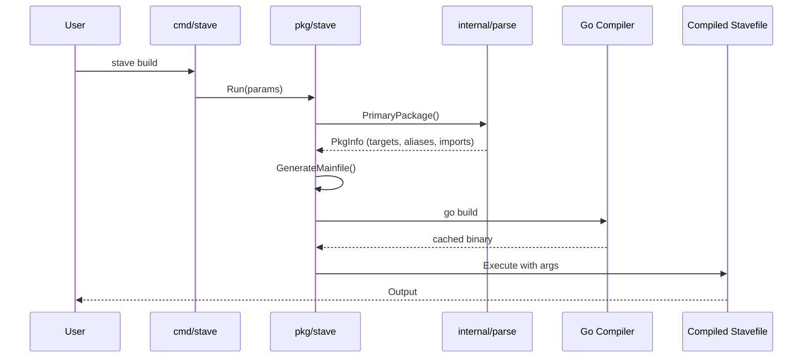
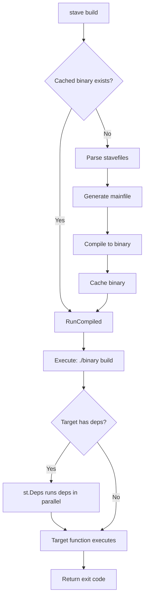
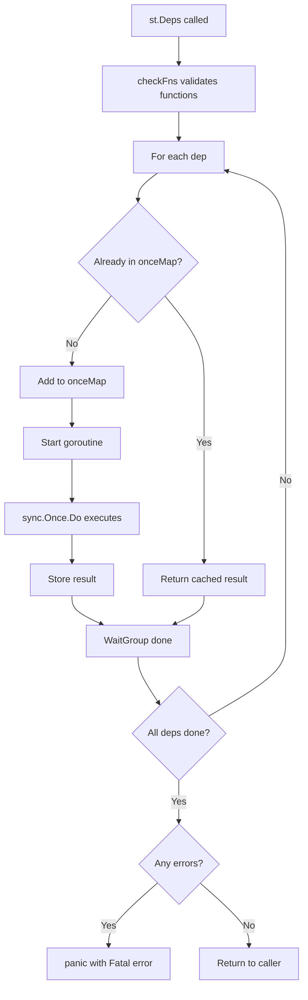

# Architecture

This document describes the internal architecture of Stave for contributors.

## High-Level Overview

Stave works by:
1. Parsing Go files with the `stave` build tag
2. Extracting exported functions as targets
3. Generating a temporary Go main file that dispatches to targets
4. Compiling this into a binary
5. Executing the binary with the requested target



## Package Structure

```
stave/
  main.go                    # Entry point
  bootstrap.go               # Self-bootstrap installer
  stavefile.go               # Stave's own build script
  
  cmd/stave/
    stave.go                 # Cobra CLI setup
    version/
      version.go             # Version info from ldflags/build info
  
  config/
    config.go                # Viper-based config loading
    defaults.go              # Default values
    paths.go                 # XDG path resolution
    validate.go              # Config validation
  
  internal/
    run.go                   # Command execution utilities
    dryrun/
      dryrun.go              # Dry-run mode logic
      onces.go               # Sync.Once variables
    env/
      env.go                 # Environment variable utilities
    log/
      constants.go           # Logging key constants
    parallelism/
      parallelism.go         # GOMAXPROCS management
    parse/
      parse.go               # Go AST parsing for stavefiles
      globals.go             # Supported argument types
  
  pkg/
    stave/
      main.go                # Core Run() function
      globals.go             # Template helpers
      config_cmd.go          # stave config subcommand
      stavefile_embedder.go  # Embedded stavefile template
      template_embedder.go   # Embedded mainfile template
      templates/
        mainfile_tmpl.go     # Generated binary template
        stavefile_tmpl.go    # Default stavefile template
    
    st/
      deps.go                # Deps, SerialDeps, CtxDeps
      fn.go                  # F() wrapper, Fn interface
      errors.go              # Fatal, Fatalf, ExitStatus
      runtime.go             # Verbose, Debug, CacheDir, etc.
      color.go               # ANSI color support
      globals.go             # Type definitions
      onces.go               # Once map for deps
    
    sh/
      cmd.go                 # Run, Output, Exec
      helpers.go             # Rm, Copy
    
    target/
      target.go              # Path, Glob, Dir
      newer.go               # PathNewer, GlobNewer, etc.
    
    ui/
      ui.go                  # Lipgloss/Fang styling
```

## Core Components

### 1. CLI Layer (`cmd/stave/`)

The CLI is built with Cobra and Fang (Charmbracelet's config integration).

```go
// cmd/stave/stave.go
func NewRootCmd(ctx context.Context) *cobra.Command {
    var runParams stave.RunParams
    rootCmd := &cobra.Command{
        Use:   "stave [flags] [target]",
        RunE: func(_ *cobra.Command, args []string) error {
            runParams.Args = args
            return stave.Run(runParams)
        },
    }
    // Register flags...
    return rootCmd
}
```

Key flags:
- `-l, --list` - List targets
- `-v, --verbose` - Verbose output
- `-d, --debug` - Debug mode
- `-f, --force` - Force recompilation
- `--dryrun` - Print commands without executing
- `--compile` - Output static binary

### 2. Runtime (`pkg/stave/`)

The `Run()` function orchestrates the entire process:

```go
// pkg/stave/main.go
func Run(params RunParams) error {
    // 1. Handle special commands (init, clean, list)
    if params.Init { return generateInit(params.Dir) }
    if params.Clean { return removeContents(params.CacheDir) }
    
    // 2. Find stavefiles
    files, err := Stavefiles(params.Dir, params.GOOS, params.GOARCH, ...)
    
    // 3. Determine exe path (hash-based caching)
    exePath, err := ExeName(ctx, params.GoCmd, params.CacheDir, files)
    
    // 4. Check cache
    if !params.Force && fileExists(exePath) {
        return RunCompiled(ctx, params, exePath)
    }
    
    // 5. Parse stavefiles
    info, err := parse.PrimaryPackage(ctx, params.GoCmd, params.Dir, fnames)
    
    // 6. Generate mainfile
    err = GenerateMainfile(binaryName, main, info)
    
    // 7. Compile
    err = Compile(ctx, CompileParams{...})
    
    // 8. Execute
    return RunCompiled(ctx, params, exePath)
}
```

### 3. Parser (`internal/parse/`)

The parser uses Go's `go/ast` and `go/doc` packages to analyze stavefiles:

```go
// internal/parse/parse.go
type PkgInfo struct {
    PkgName     string
    Files       []*ast.File
    DocPkg      *doc.Package
    Description string
    Funcs       Functions      // Exported functions = targets
    DefaultFunc *Function      // var Default = ...
    Aliases     map[string]*Function  // var Aliases = ...
    Imports     Imports        // stave:import comments
}

type Function struct {
    Name       string
    Receiver   string   // For namespace methods
    IsError    bool     // Returns error
    IsContext  bool     // Takes context.Context
    Synopsis   string   // First line of doc comment
    Args       []Arg    // Function arguments
}
```

Key parsing operations:
1. `getPackage()` - Parse Go files into AST
2. `setFuncs()` - Extract exported functions
3. `setNamespaces()` - Find `st.Namespace` types and methods
4. `setDefault()` - Find `var Default = ...`
5. `setAliases()` - Find `var Aliases = ...`
6. `setImports()` - Find `// stave:import` comments

### 4. Code Generation

The mainfile template (`templates/mainfile_tmpl.go`) generates a Go program that:
- Parses flags (from environment or command line)
- Dispatches to the appropriate target function
- Handles context and timeout
- Manages signals (SIGINT)

Key template sections:
- Target list generation
- Switch statement for target dispatch
- Argument parsing for each target type
- Error handling and exit codes

### 5. User API (`pkg/st/`)

The `st` package provides the public API for stavefiles:

#### Dependency Management

```go
// pkg/st/deps.go
func Deps(fns ...interface{}) {
    CtxDeps(context.Background(), fns...)
}

func CtxDeps(ctx context.Context, fns ...interface{}) {
    funcs := checkFns(fns)  // Validate and wrap functions
    runDeps(ctx, funcs)     // Execute in goroutines
}

// Once semantics via onceMap
type onceMap struct {
    mu *sync.Mutex
    m  map[onceKey]*onceFun
}
```

#### Function Wrapper

```go
// pkg/st/fn.go
func F(target interface{}, args ...interface{}) Fn {
    // Validate function signature
    // Create Fn that calls target with args
    return fn{
        name: funcName(target),
        id:   string(json.Marshal(args)),
        f:    func(ctx context.Context) error { ... },
    }
}
```

### 6. Shell Commands (`pkg/sh/`)

Wraps `os/exec` with conveniences:

```go
// pkg/sh/cmd.go
func Run(cmd string, args ...string) error {
    return RunWith(nil, cmd, args...)
}

func Exec(env map[string]string, stdout, stderr io.Writer, 
          cmd string, args ...string) (bool, error) {
    // Expand environment variables in cmd and args
    // Create exec.Cmd (or dry-run wrapper)
    // Run and return exit status
}
```

### 7. Configuration (`config/`)

XDG-compliant configuration with Viper:

```go
// config/config.go
func Load(opts *LoadOptions) (*Config, error) {
    v := viper.New()
    setDefaults(v)
    
    // Load user config (~/.config/stave/config.yaml)
    // Load project config (./stave.yaml)
    // Apply environment overrides (STAVEFILE_*)
    
    return &cfg, nil
}
```

## Data Flow

### Target Execution Flow



### Dependency Resolution



## Caching Strategy

Binaries are cached based on a hash of:
1. Content hash of all stavefile source files
2. Mainfile template hash
3. Stave version string
4. Go version

Cache location: `$STAVEFILE_CACHE` or platform-specific default.

When `GOCACHE` exists and `STAVEFILE_HASHFAST` is not set, Stave always recompiles to catch transitive dependency changes.

## Dry-Run Mode

Dry-run is controlled by two environment variables:
- `STAVEFILE_DRYRUN_POSSIBLE` - Set by outer Stave invocation
- `STAVEFILE_DRYRUN` - Set when `--dryrun` flag is used

This two-phase approach ensures:
1. The stavefile compilation always runs (outer invocation)
2. Only the compiled stavefile's commands are dry-run (inner invocation)

```go
// internal/dryrun/dryrun.go
func Wrap(ctx context.Context, cmd string, args ...string) *exec.Cmd {
    if !IsDryRun() {
        return exec.CommandContext(ctx, cmd, args...)
    }
    return exec.CommandContext(ctx, "echo", 
        append([]string{"DRYRUN: " + cmd}, args...)...)
}
```

## Extension Points

### Adding New Argument Types

1. Add to `internal/parse/globals.go`:
   ```go
   var argTypes = map[string]string{
       "mynewtype": "mynewtype",
   }
   ```

2. Add parsing in `internal/parse/parse.go` `ExecCode()` method

3. Add validation in `pkg/st/globals.go`

### Adding New CLI Flags

1. Add to `RunParams` in `pkg/stave/main.go`
2. Register flag in `cmd/stave/stave.go`
3. Handle in `Run()` function
4. Pass to environment if needed for compiled binary

### Adding New Configuration Options

1. Add field to `Config` struct in `config/config.go`
2. Add default in `config/defaults.go`
3. Add validation in `config/validate.go` if needed
4. Add environment variable handling in `applyEnvironmentOverrides()`

