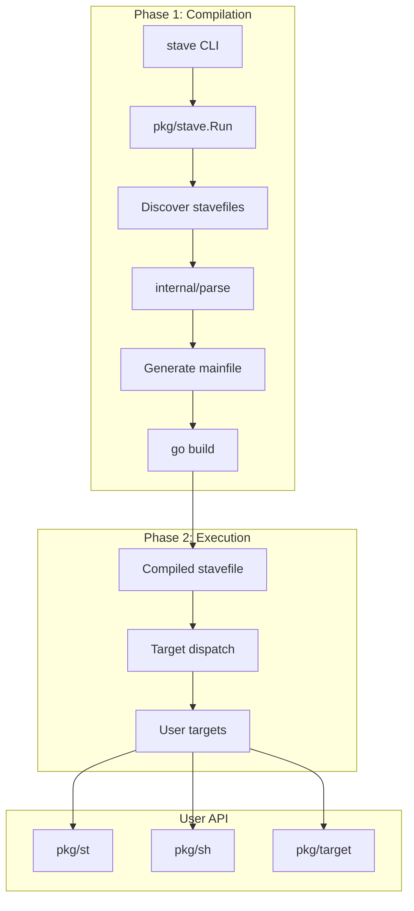
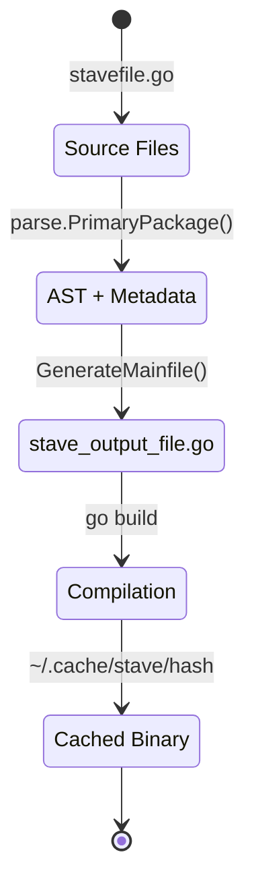
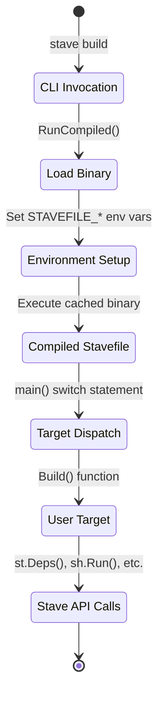

# Architecture

[Home](../index.md) > [Contributing](development.md) > Architecture

This document describes the internal structure of Stave.

## Overview

Stave operates in two phases:

1. **Compilation**: Parse stavefiles, generate a main function, compile to a binary
2. **Execution**: Run the compiled binary, which dispatches to user-defined targets



## Package Structure

### Entry Points

#### main.go

Binary entrypoint. Creates a cobra command and executes it.

```go
func main() {
    rootCmd := stave.NewRootCmd(ctx)
    stave.ExecuteWithFang(ctx, rootCmd)
}
```

#### bootstrap.go

Build-tag-ignored file for bootstrapping Stave when Stave is not installed:

```bash
go run bootstrap.go
```

### cmd/stave

CLI definition using cobra and fang.

- `stave.go`: Root command with flags (`--force`, `--verbose`, etc.)
- `version/version.go`: Version string computation from ldflags or build info

### pkg/stave

Core runtime that orchestrates stavefile compilation and execution.

#### main.go

`Run(params RunParams) error` is the main entrypoint:

1. Setup logger
2. Handle `--init`, `--clean` if requested
3. Call `stave()` for normal operation

`stave()` function:

1. `Stavefiles()`: Discover `.go` files with `stave` build tag
2. `ExeName()`: Compute cache path by hashing file contents
3. Check cache; if hit and not `--force`, run cached binary
4. `parse.PrimaryPackage()`: Parse AST, extract targets
5. `GenerateMainfile()`: Render template to `stave_output_file.go`
6. `Compile()`: Run `go build`
7. `RunCompiled()`: Execute the binary with environment setup

#### Templates

`templates/mainfile_tmpl.go`: Go text/template that generates:

- Flag parsing
- Target listing (`-l`)
- Target info (`-i`)
- Switch statement dispatching to user functions
- Signal handling

### pkg/st

User-facing API imported in stavefiles.

#### deps.go

Dependency execution:

- `Deps()`, `CtxDeps()`: Parallel execution
- `SerialDeps()`, `SerialCtxDeps()`: Sequential execution
- `runDeps()`: Spawns goroutines, collects errors
- `onces`: Global map ensuring each dependency runs once

#### fn.go

`F(target, args...)` wraps functions for use in `Deps`:

- Validates signature
- JSON-encodes args for identity
- Returns `Fn` interface

#### errors.go

`Fatal()`, `Fatalf()`: Create errors with exit codes
`ExitStatus()`: Extract exit code from error

#### runtime.go

Environment queries: `Verbose()`, `Debug()`, `GoCmd()`, `CacheDir()`, etc.

### pkg/sh

Shell command execution.

#### cmd.go

- `Run()`, `RunV()`, `RunWith()`: Execute commands
- `Output()`, `OutputWith()`: Capture stdout
- `Piper()`, `PiperWith()`: Run commands with explicit control of `stdin`, `stdout`, and `stderr`
- `Exec()`: Full control over I/O (includes `stdin`, `stdout`, and `stderr`)
- `RunCmd()`, `OutCmd()`: Command factories

All functions:

1. Expand `$VAR` in arguments
2. Check `dryrun.IsDryRun()` and print instead of execute if true
3. Wrap errors with `st.Fatalf` for proper exit codes

#### helpers.go

`Rm()`, `Copy()`: File operations respecting dry-run mode.

### pkg/target

File modification time utilities.

#### target.go

- `Path()`: Compare destination vs source files
- `Glob()`: Expand globs, then compare
- `Dir()`: Recursive directory comparison

#### newer.go

- `PathNewer()`, `GlobNewer()`, `DirNewer()`: Compare against explicit time
- `OldestModTime()`, `NewestModTime()`: Find extreme modification times

### config

XDG-compliant configuration system.

#### paths.go

`ResolveXDGPaths()`: Platform-aware resolution of config/cache/data directories.

#### config.go

- `Load()`: Read from user config, project config, environment
- `Global()`: Singleton accessor
- Uses viper for YAML parsing

#### validate.go

`Validate()`: Check configuration values (e.g., valid color names).

### internal/parse

Stavefile AST analysis.

#### parse.go

`PrimaryPackage()`:

1. Parse Go files with `go/parser`
2. Build `doc.Package` for documentation extraction
3. `setNamespaces()`: Find `st.Namespace` types
4. `setFuncs()`: Find exported functions with valid signatures
5. `setImports()`: Process `stave:import` directives
6. `setAliases()`: Process `Aliases` map variable
7. `setDefault()`: Find `Default` variable

`Function` struct contains all metadata needed for code generation:

- Name, Receiver, Package, ImportPath
- IsContext, IsError
- Args (name and type)
- Synopsis, Comment

### internal/dryrun

Dry-run mode implementation.

- `IsPossible()`: True inside compiled stavefile (env var set)
- `IsRequested()`: True if `--dryrun` passed
- `IsDryRun()`: Both possible and requested
- `Wrap()`: Returns real `exec.Cmd` or echo command

### internal/env

Environment variable utilities.

- `GetMap()`: Current environment as map
- `ToAssignments()`: Map to `[]string{"K=V"}`

### internal/parallelism

Parallelism control.

`Apply()`: Sets `GOMAXPROCS` from `STAVE_NUM_PROCESSORS` or CPU count.

## Data Flow

### Compilation



### Execution



## Caching

Compiled binaries are cached by content hash:

```text
hash = SHA256(file_contents + mainfile_template + go_version + stave_version)
path = ~/.cache/stave/<hash>
```

Cache is invalidated when:

- Any stavefile changes
- Go version changes
- Stave version changes
- `--force` is passed
- `GOCACHE` exists (to catch transitive dependency changes)

## Error Handling

Errors flow through:

1. `st.Fatal(code, msg)` in user code
2. `sh.Exec` wraps command failures with exit codes
3. `st.Deps` aggregates errors from parallel dependencies
4. Exit codes propagate to the CLI

---

## See Also

- [Development Setup](development.md) - Setting up for contribution
- [pkg/st API](../api-reference/st.md)
- [pkg/sh API](../api-reference/sh.md)
- [Home](../index.md)
