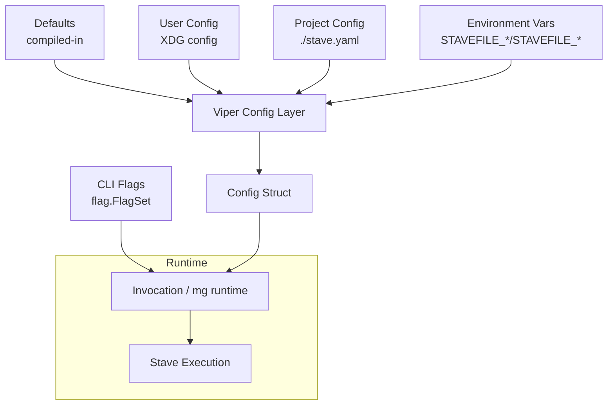
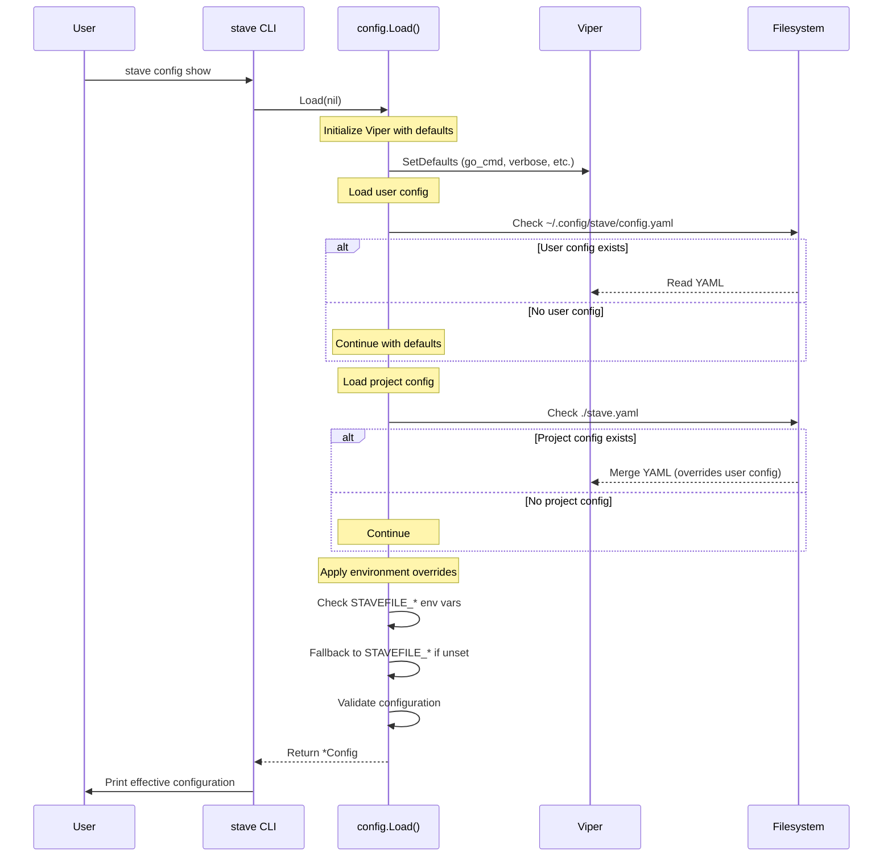

# RFC-20251130-001: XDG-Based Configuration System for Stave

## Status

- **Status**: Draft
- **Author**: James Ainslie
- **Created**: 2025-11-30
- **Target Release**: TBD

## Summary

This RFC proposes an idiomatic, XDG-compliant configuration system for Stave, built on top of `viper`.  
It introduces:

- A new `config` package providing a strongly-typed `Config` struct and XDG-aware path resolution.
- A configuration precedence model (defaults → user config → project config → environment → CLI flags).
- Backwards-compatible support for existing `STAVEFILE_*` and `STAVEFILE_*` environment variables.
- A new `stave config` command surface to inspect and initialize configuration.

The goal is to make Stave configurable in a predictable, portable way without breaking existing users.

---

## Motivation

Stave is currently configured primarily via environment variables and CLI flags. This has several drawbacks:

- **No persistent configuration**: Users cannot easily express per-user or per-project defaults in a file.
- **Non-standard paths**: Cache and config directories do not consistently follow XDG or platform conventions.
- **Discoverability**: There is no straightforward way to inspect the effective runtime configuration.
- **Scalability**: Adding new configuration options purely as env vars becomes unwieldy and hard to document.

We want:

- A **single, canonical configuration model** that can be consumed by all packages.
- A **stable on-disk format** (YAML) for user and project configuration, respecting XDG where appropriate.
- A **clear, documented precedence order** across defaults, config files, env vars, and CLI flags.
- A **non-breaking migration path** from existing `STAVEFILE_*` / `STAVEFILE_*` env-var-only configuration.

---

## Goals

- **Introduce a `config` package** that owns all configuration loading, validation, and defaults.
- **Support XDG base directory semantics** for config, cache, and data paths across Linux, macOS, and Windows.
- **Define a strict precedence model** for configuration sources.
- **Expose a `stave config` command** for initialization and inspection.
- **Remain fully backward compatible** with existing environment variables and CLI behavior.
- **Maintain strict linting and testing discipline** (no relaxation of `golangci-lint`).
- **Refactor all existing packages to use the new `config` package** as the single source of configuration truth (even if the implementation lands across multiple PRs).

## Non-Goals

- Changing the semantics or set of existing CLI flags.
- Removing or deprecating `STAVEFILE_*` / `STAVEFILE_*` environment variables in this iteration.
- Introducing a plugin-based configuration mechanism or remote configuration.

---

## High-Level Architecture

### Configuration Sources and Precedence

Configuration is resolved from the following sources, in order of **increasing precedence** (later overrides earlier):

1. **Defaults** (compiled into the binary)
2. **User config file** (XDG config home, e.g. `~/.config/stave/config.yaml`)
3. **Project config file** (`./stave.yaml` in the project root)
4. **Environment variables** (`STAVEFILE_*` and `STAVEFILE_*`)
5. **CLI flags** (parsed in `stave.Parse`, already existing)

Conceptual data flow:



Where:

- The **Viper layer** (`F`) merges defaults, user config, project config, and env vars into a single configuration.
- The **Config struct** (`H`) is a strongly-typed snapshot of configuration values.
- The **Invocation structs** (`G`) and existing runtime code draw from both `Config` and CLI flags.

### Execution Flow with `stave config show`



---

## Detailed Design

### `config` Package Overview

The new `config` package is responsible for:

- Resolving XDG-style directories (`ConfigHome`, `CacheHome`, `DataHome`).
- Loading configuration from disk (user and project files).
- Merging environment variables with backward compatibility for Mage.
- Providing defaults and validation.
- Offering a global singleton for convenience where appropriate.

Key types:

- `type Config struct` – the primary configuration struct.
- `type LoadOptions struct` – options for `Load()` (e.g. skip user/project/env).
- `type XDGPaths struct` – resolved XDG base paths and helper methods.
- `type ValidationResults` – holds validation errors and warnings.

#### `Config` Struct

Primary fields (mapped from Viper via `mapstructure` tags):

- **Build & cache**

  - `CacheDir string` – where Stave caches compiled binaries; defaults to XDG cache.
  - `GoCmd string` – Go command to use for compilation, default `"go"`.
  - `HashFast bool` – whether to use fast hashing instead of `GOCACHE`.

- **Runtime behavior**

  - `Verbose bool` – verbose target output.
  - `Debug bool` – debug messages for the runner.
  - `IgnoreDefault bool` – ignore default target in `stavefile`.

- **Output**

  - `EnableColor bool` – enable ANSI colored output.
  - `TargetColor string` – ANSI color name for target names.

- **Metadata**
  - `configFile string` – path to the loaded config file (if any, empty otherwise).

Accessor:

- `func (c *Config) ConfigFile() string` – exposes the loaded config file path.

#### XDG Path Resolution

The `config/paths.go` file defines:

- `type XDGPaths struct { ConfigHome, CacheHome, DataHome string }`
- `func ResolveXDGPaths() XDGPaths`
- Methods:
  - `ConfigDir() string` → app-specific config dir (e.g. `~/.config/stave`)
  - `CacheDir() string` → app-specific cache dir
  - `DataDir() string` → app-specific data dir
  - `ConfigFilePath() string` → full path to `config.yaml`

Platform behavior:

- **Linux/Unix**:

  - `XDG_CONFIG_HOME` → `$XDG_CONFIG_HOME`
  - otherwise `~/.config`
  - caches in `~/.cache`, data in `~/.local/share`

- **macOS**:

  - Config: `~/.config/stave` (align with CLI tools)
  - Cache: `~/Library/Caches/stave`
  - Data: `~/Library/Application Support/stave`

- **Windows**:
  - Config: `%APPDATA%\stave`
  - Cache: `%LOCALAPPDATA%\stave\cache` fallback patterns respected.

#### Loading Configuration: `Load`

Signature:

```go
func Load(opts *LoadOptions) (*Config, error)
```

Behavior:

1. If `opts` is `nil`, a default `LoadOptions` is used.
2. A new `viper.Viper` instance is constructed.
3. Defaults are applied via `setDefaults(...)`.
4. Config file name/type are set to `config.yaml`.
5. Config paths are added:
   - User config: `XDGPaths.ConfigDir()` (unless `SkipUserConfig`).
   - Project config: `ProjectDir` or `os.Getwd()` (unless `SkipProjectConfig`).
6. Environment variables are bound (unless `SkipEnv`) with both:
   - Preferred: `STAVEFILE_*`.
   - Legacy: `STAVEFILE_*` (used if the preferred one is unset).
7. Config file is read:
   - `ConfigFileNotFoundError` is ignored (config is optional).
   - Other errors are returned.
8. Viper unmarshals into `Config` using `mapstructure`.
9. `CacheDir` is defaulted to XDG cache if empty, and `~/` is expanded.
10. Validation is run:
    - Warnings are written to `opts.Stderr` (default `os.Stderr`).
    - Errors cause `Load` to return with a combined error.

This design makes `Load` pure and deterministic given environment, filesystem, and options.

#### Validation

`config/validate.go` defines:

- `type ValidationError struct { Field, Message string }`
- `type ValidationWarning struct { Field, Message string }`
- `type ValidationResults struct { Errors []ValidationError; Warnings []ValidationWarning }`

API:

- `func (r ValidationResults) HasErrors() bool`
- `func (r ValidationResults) HasWarnings() bool`
- `func (r ValidationResults) ErrorMessage() string` – for logging/propagation.
- `func (r ValidationResults) WriteWarnings(w io.Writer)`
- `func (c *Config) Validate() ValidationResults`

Currently validated:

- `target_color` must be one of a fixed set of ANSI color names (case-insensitive). Invalid values produce a `ValidationError`.

Future validations can be added as needed (path existence, type ranges, etc.).

#### Global Singleton

For convenience, a global singleton is provided:

- `func Global() *Config`
- `func SetGlobal(cfg *Config)`
- `func ResetGlobal()`

The singleton is:

- Lazily loaded on first call to `Global()`.
- Thread-safe via `RWMutex`.
- Overridable in tests via `SetGlobal` and `ResetGlobal`.

Note: while globals are usually discouraged, this is intentionally constrained to a single configuration object and is fully covered by tests and lint exceptions with explicit justification.

---

## CLI Integration: `stave config`

The `stave` package introduces a new subcommand, routed before legacy flag parsing:

- **Entry point**: `ParseAndRun` now checks `args[0] == "config"` and delegates to:
  - `RunConfigCommand(stdout, stderr, args[1:])`.

### Subcommands

`stave config` supports three subcommands (plus default behavior):

1. **`stave config`** (no subcommand)

   - Equivalent to `stave config show`.
   - Loads the effective configuration using `config.Load(nil)` and prints:
     - The source config file (if present).
     - All key configuration values in a human-readable YAML-like form.

2. **`stave config show`**

   - Explicit form of the above.
   - Same output and behavior.

3. **`stave config init`**

   - Calls `config.WriteDefaultConfig()`:
     - Creates the user config directory (`XDGPaths.ConfigDir()`).
     - Writes a default `config.yaml` with secure permissions (`0600`).
     - Fails if the file already exists, returning exit code `1`.
   - On success, prints the created path to `stdout`.

4. **`stave config path`**
   - Prints the canonical paths for:
     - User config file.
     - Config directory.
     - Cache directory.
     - Data directory.
   - Also reports the **currently active** config file, if `config.Load(nil)` finds one.

Usage text is integrated into `stave -h` output and `stave config -h`.

---

## Backward Compatibility

This RFC is explicitly designed to be backwards compatible:

- **Environment variables**:

  - Existing `STAVEFILE_*` env vars are still honored and now also visible through `stave config show`.
  - Legacy `STAVEFILE_*` env vars continue to work as a fallback if `STAVEFILE_*` is unset.

- **CLI flags**:

  - No existing flags are removed or changed.
  - `stave config` is a new top-level subcommand; flag-based commands (`-init`, `-clean`, etc.) are unchanged.

- **On-disk behavior**:
  - No existing cache directories are removed or migrated as part of this RFC.
  - A new XDG cache dir is used only when configuration explicitly or implicitly requires it.

If a user never creates a config file and never uses the new subcommand, their behavior remains the same modulo the XDG-defaulted cache path becoming the canonical default.

---

## Alternatives Considered

1. **Ad-hoc config file parsing without Viper**

   - Pros: fewer dependencies, full control.
   - Cons: re-implements env binding, file merging, and mapstructure decoding; increases maintenance burden.

2. **Using only environment variables, no config files**

   - Pros: simplest change; no extra files.
   - Cons: fails to address motivation (no persistent per-user/project configuration, harder discoverability).

3. **Using TOML or JSON as the primary config format**

   - YAML is chosen because of its ergonomics for CLI tools and alignment with common Go CLI ecosystem patterns.
   - Viper still supports TOML and JSON if needed in the future.

4. **Making `config.Global()` the only way to access configuration**
   - This RFC encourages passing `*config.Config` explicitly where possible.
   - The global is provided as a pragmatic convenience, not the primary API.

---

## Testing Strategy

The following tests are part of the scaffold:

- **Path resolution**:

  - `TestResolveXDGPaths`, `TestXDGPaths_*`, `TestUserHomeDir` – ensure XDG paths and helpers behave correctly across platforms and env overrides.

- **Loading behavior**:

  - `TestLoad_Defaults` – defaults with all sources disabled.
  - `TestLoad_EnvironmentVariables` – `STAVEFILE_*` precedence.
  - `TestLoad_LegacyEnvironmentVariables` – `STAVEFILE_*` fallback.
  - `TestLoad_ProjectConfig` – project-local `config.yaml` handling.

- **Validation**:

  - `TestConfig_Validate_InvalidColor` and `TestConfig_Validate_ValidColors`.

- **Global singleton**:

  - `TestGlobal_Singleton`, `TestSetGlobal`.

- **Config command**:
  - `TestRunConfigCommand_Show`, `ShowExplicit`, `Path`, `Init`, `InitAlreadyExists`, `UnknownSubcommand`, `Help`.

All new code passes `golangci-lint` with strict settings; any `//nolint` usage is justified inline.

---

## Migration Plan

1. **Introduce `config` package and `stave config` (this RFC)**

   - Already implemented in scaffold branch `users-jamesainslie-create-config-scaffold`.
   - No behavioral changes for users who do not opt into config files or the new command.

2. **Gradual integration of config into runtime** (future RFC/PR):

   - Refactor `mg/runtime.go` and related code to consume `config.Config` instead of reading env vars directly.
   - Maintain wrappers such as `mg.Verbose()`, `mg.CacheDir()`, etc., internally delegating to `config.Global()` for backward compatibility.

3. **Documentation updates**:

   - Update `README.md` and any user docs to document:
     - `stave config` usage.
     - Config file format and precedence.
     - XDG-based paths.

4. **Optional deprecation (long-term)**:
   - If desired, in a later major version we may:
     - Warn when using `STAVEFILE_*` env vars without `STAVEFILE_*`.
     - Eventually deprecate legacy names, after a clear migration window.

---

## Resolved Questions

1. **Project config filename**  
   Project-level configuration uses `stave.yaml` in the project root. This explicit naming avoids confusion with other tools that may use generic `config.yaml` files. User-level configuration remains at `~/.config/stave/config.yaml`.

2. **Exposure in `mg` / `stavefile` APIs**  
   Configuration is exposed to stavefiles via the `config` package. Stavefiles can import `github.com/yaklabco/stave/config` and call `config.Global()` to access the full `Config` struct. This provides:

   - **Type safety**: Strongly-typed access vs string parsing of env vars
   - **Discoverability**: IDE autocompletion and documentation
   - **Consistency**: Same config that drives stave is available to targets

   Example usage in a stavefile:

   ```go
   import "github.com/yaklabco/stave/config"

   func Build() error {
       cfg := config.Global()
       if cfg.Verbose {
           fmt.Println("Building with verbose output...")
       }
       return nil
   }
   ```

3. **Future configuration options**  
   The following options are candidates for future implementation (not committed):

   **Build Behavior:**

   - `parallel_jobs` (int) - max concurrent dependency execution
   - `timeout` (duration) - default timeout for targets
   - `rebuild_strategy` - "always", "smart", "never"

   **Output & Logging:**

   - `log_format` - "text", "json" for structured logging
   - `timestamp_format` - custom timestamp format
   - `quiet` (bool) - suppress non-error output

   **Target Discovery:**

   - `default_target` (string) - override `//stave:default` annotation
   - `ignore_patterns` ([]string) - globs to skip when scanning

   **Developer Experience:**

   - `shell` (string) - shell for `sh.Run()` commands
   - `env_file` (string) - path to `.env` file to auto-load

4. **Central metrics/telemetry toggles**  
   Yes. If Stave introduces metrics or telemetry, the configuration will live in this config system (e.g. `telemetry.enabled`, `telemetry.endpoint`).

---

## Conclusion

This RFC defines an idiomatic, XDG-compliant configuration system for Stave, centered on a dedicated `config` package backed by `viper`, and a new `stave config` CLI surface.  
It provides a solid, testable foundation for future configuration-driven features while preserving backward compatibility with existing environment variables and CLI behavior.
