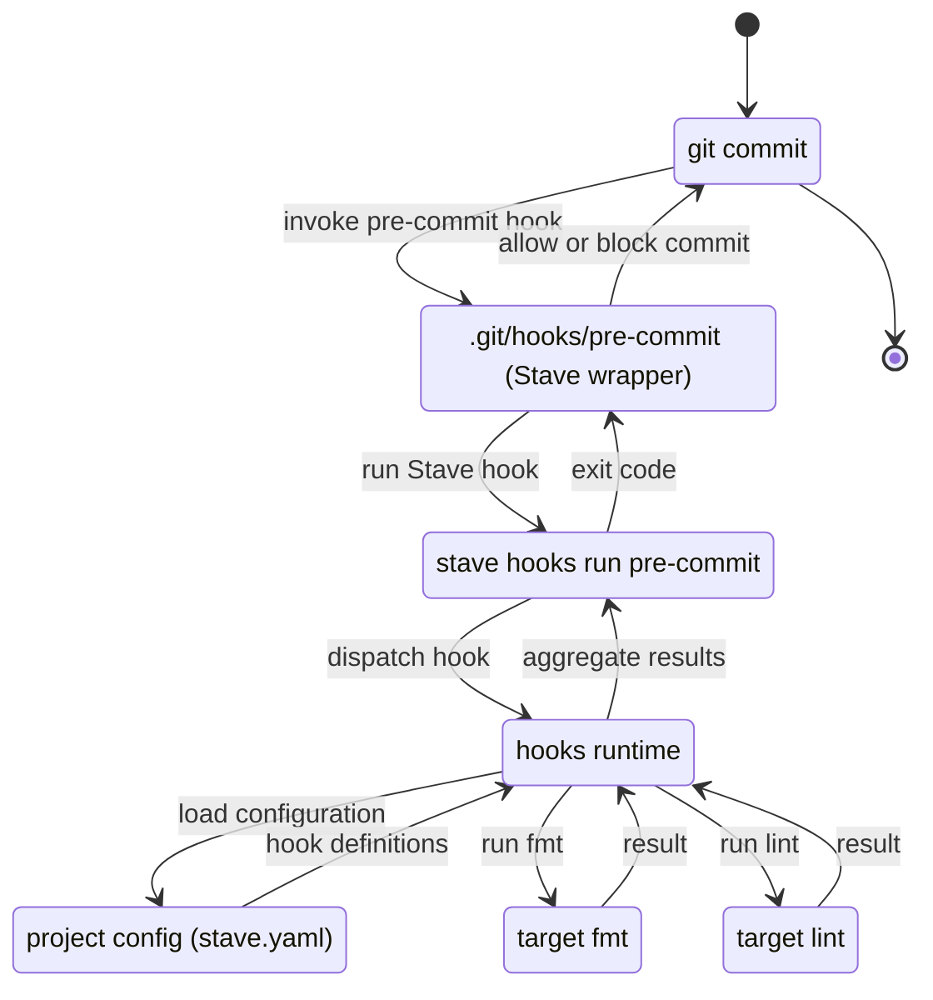
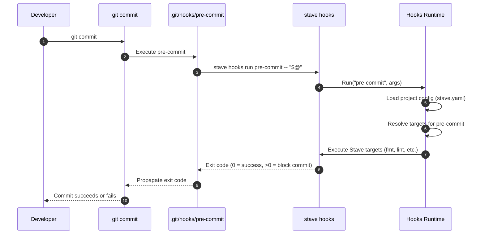

# RFC: Native Git Hook Management in Stave

**RFC ID:** rfc-20251204-git-hooks  
**Status:** Draft  
**Author:** Core Team  
**Created:** 2025-12-04  
**Target Release:** TBD

## Summary

This RFC proposes adding **first-class Git hook management** to Stave, so that both the Stave repository itself and downstream projects can manage Git hooks without external tooling such as Husky.

Concretely, this RFC introduces:

- A `stave hooks` CLI surface for **installing, listing, running, and uninstalling** project-local Git hooks.
- A **declarative hook configuration model** (project-level) describing which Stave targets should run for each Git hook (e.g. `pre-commit`, `pre-push`).
- A small, portable **Git hook wrapper script** that delegates to `stave hooks run <hook>` and enforces exit codes.
- A migration path for the Stave repository itself to **replace Husky** with native Stave-based hooks.

The goal is to eliminate the Node/Husky dependency for Git hooks, reduce duplication across projects, and allow teams to express hook behavior using Stave targets.

---

## Motivation

Today, the Stave repository uses Husky (Node-based) to manage Git hooks. This has several drawbacks:

- **Extra dependency surface:** Contributors must have Node tooling available, in addition to Go and Stave itself.
- **Tooling mismatch:** Stave positions itself as a modern replacement for `make`, but relies on another tool for hooks that could instead be expressed as Stave targets.
- **Inconsistent experience:** Downstream Stave users who want Git hooks must choose and integrate their own hook manager (Husky, `pre-commit`, custom scripts, etc.), often re-implementing the same logic.
- **Limited composability:** Hook logic is not naturally shared or re-used as Stave targets, even when the logic already exists as Stave tasks (e.g. `lint`, `test`, `fmt`).

We want:

- A **Stave-native Git hook system** that can be used both by this repository and by end users.
- A **simple, portable hook wrapper** that works anywhere Git runs and only depends on a working `stave` binary on `PATH`.
- A **single source of truth** for pre-commit / pre-push / etc. logic, by expressing it as Stave targets.
- A **clean migration path** away from Husky without breaking contributor workflows.

---

## Goals

- **Provide a `stave hooks` command** for managing Git hooks at the project level.
- **Allow projects to declare hook behavior in configuration** (e.g. `stave.yaml`), mapping Git hook names to Stave targets.
- **Generate small, POSIX-compatible Git hook scripts** that delegate to `stave hooks run <hook>`.
- **Support all standard Git hook names in a generic way**, allowing any valid hook name to be configured, with documented examples for common hooks such as `pre-commit`, `pre-push`, `commit-msg`, and `prepare-commit-msg`.
- **Provide a clear, developer-friendly bootstrap flow** (an `init`-style command) to set up hooks and starter configuration with a single command.
- **Enable Stave itself to migrate off Husky** to the new system.
- **Respect developer and CI environments** with explicit env-based controls to enable or disable hooks, plus optional user-level init scripts for PATH and tooling setup.
- **Maintain strict linting discipline** (`golangci-lint` remains unchanged) and do not introduce Git workflows that rely on `--no-verify`.

---

## Non-Goals

- **Cross-VCS support:** Only Git is in scope (no Mercurial, SVN, etc.).
- **Remote-managed hooks or plugins:** This RFC focuses on local, repository-scoped hooks.
- **Re-implementing Husky’s full feature surface:** For example, `lint-staged`-style file selection is out of scope for the first iteration.
- **Global user-level hook management:** This RFC targets project-level hooks; user-global hooks could be considered later.

---

## High-Level Architecture

### Components

- **Project configuration**  
  A new section in project configuration (e.g. `stave.yaml`) describes Git hooks and the Stave targets they should run.

- **Hooks runtime (`internal/hooks` or `pkg/hooks`)**  
  A Go package responsible for:

  - Loading hook configuration.
  - Resolving and running Stave targets for a given Git hook.
  - Translating exit codes and messages back to Git.

- **CLI entrypoint: `stave hooks`**  
  A new subcommand that provides:

  - `stave hooks init` – opinionated bootstrap that creates starter hook configuration and installs wrappers.
  - `stave hooks install` – install or update hook scripts into the Git hooks path.
  - `stave hooks uninstall` – remove hook scripts installed by Stave.
  - `stave hooks list` – list configured hooks and their targets.
  - `stave hooks run <hook>` – run all configured targets for a hook; invoked by Git hook scripts.

- **Git hook scripts**  
  Small, POSIX shell scripts written into the effective Git hooks directory (either `.git/hooks/<hook>` or a directory configured via `core.hooksPath`) that:
  - Are executable.
  - Optionally source a per-user init script (for environment setup) before invoking Stave.
  - Call `stave hooks run <hook> -- "$@"`.
  - Propagate exit status back to Git.

### Data & Control Flow



At a high level:

1. Git invokes `.git/hooks/pre-commit`.
2. The hook script invokes `stave hooks run pre-commit`.
3. The hooks runtime loads project configuration and resolves the list of configured targets.
4. Targets are executed via the existing Stave runtime.
5. Failures cause a non-zero exit code, preventing the Git action (unless explicitly marked as non-blocking in future extensions).

### Commit Flow (Sequence)



Steps:

1. **Developer runs `git commit`:** From the developer’s perspective this is a standard Git operation: Git collects staged changes, may open an editor for the commit message, and prepares to update the repository history. Before the commit is finalized, Git will consult any configured hooks, starting with `pre-commit`.

2. **Git invokes the `.git/hooks/pre-commit` script:** Git determines the effective hooks directory (either `.git/hooks` or the directory configured via `core.hooksPath`) and checks for an executable `pre-commit` file. If present, Git runs this script synchronously; if it exits non-zero, Git aborts the commit and surfaces the hook’s error output to the user.
   

3. **The pre-commit hook calls `stave hooks run pre-commit -- "$@"`:** The Stave-generated hook script performs any optional user initialization (e.g. sourcing a per-user init script, honoring `STAVE_HOOKS`), then execs the `stave` binary with `hooks run pre-commit`. All original hook arguments are forwarded via `-- "$@"`, so the hooks runtime can see the same context Git provided to the script.

4. **The `stave hooks` CLI delegates to the hooks runtime:** Inside the `stave` process, the CLI layer parses the `hooks run` invocation, validates the hook name, and constructs a request object that includes the hook name, arguments, and environment. It then hands control to the dedicated hooks runtime package, which encapsulates the logic for loading configuration and executing targets.

5. **The hooks runtime loads project configuration from `stave.yaml`:** The runtime uses the existing `config.Load` mechanism to read configuration, merging defaults, user-level config, and project-level `stave.yaml` according to Stave’s precedence rules. If configuration is missing or malformed, the runtime decides whether to treat this as a hard error (blocking the commit) or a soft warning, based on the design of the hooks feature.
   The runtime uses the existing `config.Load` mechanism to read configuration, merging defaults, user-level config, and project-level `stave.yaml` according to Stave’s precedence rules. If configuration is missing or malformed, the runtime decides whether to treat this as a hard error (blocking the commit) or a soft warning, based on the design of the hooks feature.

6. **The hooks runtime resolves the configured targets for `pre-commit`:** The runtime looks up the `HooksConfig` entry for the requested hook and converts each item into an internal representation. If no configuration exists for the hook, it returns success immediately.

7. **Configured Stave targets (e.g. `fmt`, `lint`) are executed:** Targets run sequentially through the existing Stave execution pipeline. The runtime records exit codes and diagnostics for each target.

8. **The hooks runtime returns an aggregated exit code to the `stave hooks` CLI:** Execution halts on the first failure (fail-fast). The runtime returns that target's exit code along with a diagnostic message identifying which target failed.

9. **The CLI propagates that exit code back through the pre-commit hook to Git:** The `stave hooks run` command exits with the status chosen by the runtime; the shell script wrapper immediately exits with that same code, so no information is lost. From Git’s perspective, the pre-commit hook is just another process whose success or failure is reflected in its exit status.
   The `stave hooks run` command exits with the status chosen by the runtime; the shell script wrapper immediately exits with that same code, so no information is lost. From Git’s perspective, the pre-commit hook is just another process whose success or failure is reflected in its exit status.

10. **Git either completes the commit or blocks it based on the hook exit code:** If the pre-commit hook exits with `0`, Git proceeds to finalize the commit (writing the new commit object and updating refs). If the hook exits with a non-zero status, Git aborts the commit, prints the hook’s output, and leaves the working tree and index unchanged so the developer can fix issues and re-run `git commit` (or explicitly opt out with `--no-verify`, which Stave itself does not invoke).
    If the pre-commit hook exits with `0`, Git proceeds to finalize the commit (writing the new commit object and updating refs). If the hook exits with a non-zero status, Git aborts the commit, prints the hook’s output, and leaves the working tree and index unchanged so the developer can fix issues and re-run `git commit` (or explicitly opt out with `--no-verify`, which Stave itself does not invoke).

---

## Environment Controls and User Init

To give developers explicit control over when hooks run and to support environments such as GUIs and CI servers, the hooks system introduces two environment-level concepts:

- A **global hooks toggle**, e.g. `STAVE_HOOKS`:

  - If `STAVE_HOOKS=0`, both `stave hooks install` and `stave hooks run` act as no-ops and exit successfully.
  - If `STAVE_HOOKS=debug`, the generated shell wrappers enable shell tracing (e.g. `set -x`) before invoking Stave.
  - Any non-empty value other than `0` or `debug` is treated as “hooks enabled” (default).

- An optional **user-level init script**:
  - The generated wrapper scripts will source `${XDG_CONFIG_HOME:-$HOME/.config}/stave/hooks/init.sh` if it exists.
  - This script is intended for per-user, cross-project customization such as:
    - Initializing language or version managers (e.g. Node via `nvm`, Go via a custom setup).
    - Adjusting `PATH` for GUI clients.
    - Globally disabling hooks on a given machine by exporting `STAVE_HOOKS=0`.

These mechanisms allow hooks to be:

- **Opt-out in CI and production** (e.g. via `STAVE_HOOKS=0`).
- **Debuggable** when needed (`STAVE_HOOKS=debug`).
- **Configurable on a per-developer basis** without modifying project configuration.

---

## Configuration Model

### Project-Level Configuration

Hook configuration is project-scoped and lives alongside other Stave configuration. This RFC proposes adding a `hooks` section to the project config file (`./stave.yaml`), building on the existing configuration system (see `rfc-20251130-001-xdg.md`).

Example:

```yaml
hooks:
  pre-commit:
    - target: fmt
    - target: lint
      args: ["--fast"]
  pre-push:
    - target: test
      args: ["./..."]
  commit-msg:
    - target: validate-commit-message
      passStdin: true
```

Proposed schema (conceptual, Go struct):

```go
type HookConfig struct {
    Target    string   `mapstructure:"target" yaml:"target"`
    Args      []string `mapstructure:"args,omitempty" yaml:"args,omitempty"`
    PassStdin bool     `mapstructure:"passStdin,omitempty" yaml:"passStdin,omitempty"`
}

type HooksConfig map[string][]HookConfig // keyed by git hook name
```

Notes:

- **Keyed by Git hook name**: e.g. `pre-commit`, `pre-push`, `commit-msg`.
- **Targets refer to Stave targets**: these must exist in the stavefile.
- **Arguments** are passed as additional CLI arguments to the target invocation.
- **`passStdin`** indicates whether stdin from Git should be forwarded (important for `commit-msg` and `prepare-commit-msg`).

The `config` package would be extended to include a `Hooks HooksConfig` field on the main `Config` struct, following the same precedence rules as other configuration keys.

---

## CLI Design: `stave hooks`

### Entry Point

Similar to `stave config`, the main CLI dispatch will gain a new subcommand:

- `stave hooks <subcommand> [flags]`

If `hooks` is the first positional argument, flag parsing is delegated to a dedicated hooks command handler.

### Subcommands

#### `stave hooks init`

Provides an opinionated bootstrap experience:

- Ensures the current directory is inside a Git repository.
- Creates a minimal `stave.yaml` if one does not exist, adding a starter `hooks` section such as:
  - `pre-commit` running `fmt` and `lint` (if these targets exist or are likely to be added).
- Calls `stave hooks install` to write wrapper scripts into the Git hooks path.
- Prints clear follow-up instructions pointing developers at:
  - The `hooks` section of `stave.yaml` to customize targets.
  - The `stave hooks list` command for inspection.

`init` is intended as a “one command setup” for new projects. Existing projects can still use `install` directly.

#### `stave hooks install`

Installs or updates Stave-managed hooks into the current repository:

- Validates that the current directory is inside a Git repository (by locating `.git` or an existing `core.hooksPath`).
- Determines the effective Git hooks directory:
  - If `core.hooksPath` is set, uses that directory.
  - Otherwise, defaults to `.git/hooks`.
- For each hook defined in `hooks` configuration:
  - Writes a script to `<hooksDir>/<hook>` (e.g. `.git/hooks/pre-commit`).
  - Marks the file as executable.
  - If a hook file already exists:
    - If it was previously installed by Stave (detected via a marker comment), it is safely updated in-place.
    - Otherwise, the command fails with instructions for manual resolution (no destructive overwrite). A future extension may support chaining with existing scripts.

Flags (proposed):

- `--force` (future / optional) – overwrite existing Stave-managed hooks without prompting.
- `--hooks-dir` (future / optional) – explicitly specify a hooks directory instead of inferring it; for advanced monorepo layouts only.

#### `stave hooks uninstall`

Removes hook scripts previously installed by Stave:

- Scans the effective Git hooks directory for files containing the Stave marker comment.
- Deletes only those files (or rewrites them to remove Stave’s wrapper if we later support chaining).

#### `stave hooks list`

Prints the currently configured hooks and their targets, based on project configuration:

Example output:

```text
pre-commit:
  - fmt
  - lint --fast
pre-push:
  - test ./...
```

This command does not depend on `.git` and can be run in CI or documentation examples.

#### `stave hooks run <hook>`

Runs all configured targets for the named hook. This is intended to be called from hook scripts, not typically by humans (though it can be useful for debugging).

Behavior:

- Respects `STAVE_HOOKS`:
  - If `STAVE_HOOKS=0`, exits immediately with status `0` and logs that hooks are disabled.
  - If `STAVE_HOOKS=debug`, enables debug logging and (where applicable) shell tracing in wrappers.
- Loads configuration via `config.Load` (respecting project-level and user-level config).
- Resolves the `Hooks` mapping for `<hook>`.
- Executes configured targets sequentially (first iteration) using Stave’s runtime.
- Propagates the first non-zero exit as the process exit code, emitting a concise diagnostic such as:
  - `stave: hook <hook> failed at target <name> (exit <code>)`.
- If no hook is configured for the given name, exits successfully (exit code 0) with an informational message.

---

## Git Hook Script Format

Stave will generate minimal, POSIX-compatible wrapper scripts. For example, for `pre-commit`:

```sh
#!/bin/sh
# Installed by Stave: DO NOT EDIT BY HAND

# Optional user-level initialization (PATH, version managers, etc.)
i="${XDG_CONFIG_HOME:-$HOME/.config}/stave/hooks/init.sh"
[ -f "$i" ] && . "$i"

# Global toggle and debug controls
if [ "${STAVE_HOOKS-}" = "0" ]; then
  exit 0
fi
[ "${STAVE_HOOKS-}" = "debug" ] && set -x

if command -v stave >/dev/null 2>&1; then
  stave hooks run pre-commit -- "$@"
  exit $?
else
  echo "stave: 'stave' binary not found on PATH; skipping pre-commit hook." >&2
  exit 0
fi
```

Key properties:

- **No shell-specific features** beyond POSIX `sh` are used.
- If `stave` is not on `PATH`, the hook **does not block** the Git operation, but emits a warning.
- Hooks can be **globally disabled** via `STAVE_HOOKS=0`, and made verbose via `STAVE_HOOKS=debug`.
- A user-level init script can be used to initialize version managers or further customize behavior.
- The script is clearly marked as Stave-managed via a comment marker.

Other hooks (e.g. `commit-msg`) will follow the same wrapper pattern but preserve stdin when needed.

---

## Integration with Existing Configuration System

This RFC assumes the configuration system described in `rfc-20251130-001` is available. The integration points are:

- Extend `config.Config` with:
  - `Hooks HooksConfig` (as defined earlier).
- Extend validation to:
  - Ensure hook names are valid Git hook names (or at least non-empty).
  - Ensure target names are non-empty.
  - Optionally warn on unknown hook names.
- Use the existing `config.Load` mechanism in the hooks runtime to respect:
  - Defaults → user config → project config → env → CLI flags (where applicable).

This keeps hook configuration consistent with the rest of Stave’s configuration story.

---

## Backward Compatibility

### For the Stave Repository

- Initially, Husky and Stave-managed hooks can **co-exist**:
  - Husky remains in place during the initial implementation and validation of `stave hooks`.
  - The Stave repo can add a `stave.yaml` with hook configuration and a `stave hooks install` step in the contributor setup.
- Once `stave hooks` is stable and widely tested:
  - Husky can be removed from the repository.
  - Documentation (e.g. development setup) is updated to remove Node/Husky requirements.

### For Downstream Users

- Projects that do not opt into `hooks` configuration or `stave hooks install` are unaffected.
- Existing Husky or other hook setups remain untouched; Stave will not overwrite `.git/hooks/*` unless explicitly asked to via `stave hooks install`.
- No existing CLI flags or environment variables change behavior.

### Git Workflow Semantics

- This RFC does **not** introduce any automatic usage of `git commit --no-verify` or similar flags.  
  Stave will respect Git’s default behavior of enforcing hook exit codes.

---

## Alternatives Considered

1. **Continue using Husky in the Stave repo only**
   - Pros: No new code; Husky is widely used and battle-tested.
   - Cons: Keeps Node as a dependency; does not help downstream users; inconsistent with Stave’s positioning as a build/task orchestrator.

---

## Testing Strategy

- **Unit tests** for:

  - Parsing and validating `HooksConfig` from YAML.
  - Mapping hook names to targets and arguments.
  - Exit code translation (first failing target drives result).

- **Integration tests** using temporary directories:

  - Create a fake Git repository (`.git/` structure).
  - Write a minimal `stave.yaml` with hook configuration.
  - Run `stave hooks install` and assert that `.git/hooks/pre-commit` is created and executable.
  - Simulate invoking the hook script and assert that:
    - Configured targets are called.
    - Exit codes are propagated.

- **Repository-level tests** (optional but desirable):
  - A CI job that runs `stave hooks install` and then executes `stave hooks run pre-commit` to verify hook behavior without needing actual Git commands.

All new code must pass `golangci-lint` under the existing configuration; any `//nolint` annotations must be explicitly justified.

---

## Migration Plan

1. **Implement hooks runtime and CLI scaffold**

   - Introduce `hooks` package and `stave hooks` CLI entrypoint with `install`, `uninstall`, `list`, and `run`.
   - Add `Hooks HooksConfig` to the `config.Config` struct and wire it through `config.Load`.

2. **Adopt `stave hooks` in the Stave repository**

   - Add a `stave.yaml` with initial hook configuration (e.g. `pre-commit` running `fmt` and `lint`).
   - Update contributor documentation (`development-setup.md`, etc.) to include `stave hooks install`.
   - Run both Husky and Stave hooks in parallel for a trial period.

3. **Remove Husky**

   - Once `stave hooks` is validated, remove Husky configuration and Node-based hook setup from the repository.
   - Simplify development setup documentation to no longer require Node for hooks.

4. **Document for downstream users**
   - Add user-guide documentation on:
     - Configuring hooks in `stave.yaml`.
     - Running `stave hooks install` / `uninstall`.
     - Example setups for common workflows (Go fmt, lint, tests).

---

## Open Questions

1. **Chaining with existing hooks**  
   Should `stave hooks install` support chaining to an existing `.git/hooks/<hook>` script (instead of failing when a non-Stave hook exists), and if so, how do we manage order and error propagation?

2. **Parallel vs. sequential target execution**  
   For some hooks (e.g. `pre-commit`), parallel execution of independent targets might be desirable. Should we allow users to opt into `st.Deps`-style parallelism per hook?

3. **Per-developer overrides**  
   Should hooks be configurable in user-level config (e.g. enabling/disabling certain hooks or targets) while keeping project defaults in `stave.yaml`?

4. **Windows support specifics**  
   While Git for Windows supports POSIX-like hooks, do we need any special handling for paths or shells on Windows beyond ensuring our scripts are compatible with Git Bash?

5. **Future global hooks story**  
   Should Stave eventually support a global `stave hooks` mode that manages `core.hooksPath` and shared hook definitions across repositories, or should we keep the scope strictly project-local?

---

## Future Enhancements

The following features are out of scope for the initial implementation but are candidates for future iterations. They are documented here for consideration and to inform the initial design.

### CLI Enhancements

#### `stave hooks status`

A diagnostic command to inspect hook health:

```text
Hooks directory: .git/hooks
Installed hooks:
  pre-commit    installed (up to date)
  pre-push      installed (out of sync with config)
  commit-msg    configured but not installed

STAVE_HOOKS: (unset, hooks enabled)
stave binary:  /usr/local/bin/stave (v0.5.0)
```

This would help developers diagnose why hooks are not running as expected.

#### Dry-Run Mode

`stave hooks run --dry-run <hook>` or `STAVE_HOOKS=dry-run`:

```text
Would run for pre-commit:
  1. fmt
  2. lint --fast
```

Useful for verifying configuration without executing targets.

#### Pre-flight Validation

`stave hooks install` could verify that all configured targets exist in the stavefile before writing hook scripts:

```text
Error: target 'format' not found in stavefile
  configured in: stave.yaml (hooks.pre-commit[0])
  hint: did you mean 'fmt'?
```

This prevents frustrating runtime errors at commit time.

### Output and Feedback

#### Timing Feedback

Display execution time for each target and total hook duration:

```text
pre-commit:
  fmt .............. 0.2s
  lint ............. 1.8s
  -------------------
  total              2.0s
```

#### Progress Indicators

For hooks with multiple targets, show progress:

```text
pre-commit: running fmt... done (0.2s)
pre-commit: running lint...
```

This addresses the "is it hung?" concern during long-running hooks.

#### Coloured Output

Use ANSI colours (respecting `NO_COLOR` and `enable_color` configuration):
- Green checkmarks for passed targets
- Red indicators for failures
- Yellow for warnings or skipped targets

#### Skip Notification

When hooks are disabled, optionally notify the user:

```text
[stave] hooks disabled (STAVE_HOOKS=0) - commit proceeding without checks
```

Suppressed via `STAVE_HOOKS_QUIET=1` for scripted environments.

### Configuration Extensions

#### Selective Target Skip

Environment variable to skip specific targets without disabling all hooks:

```sh
STAVE_HOOKS_SKIP=lint git commit -m "WIP"
```

More granular than `STAVE_HOOKS=0` for work-in-progress commits.

#### Continue-on-Failure Mode

```yaml
hooks:
  pre-commit:
    fail_fast: false  # run all targets even if one fails
```

Report all failures at once rather than stopping at the first.

#### Timeout Support

```yaml
hooks:
  pre-commit:
    - target: lint
      timeout: 30s
```

Terminate targets that exceed the specified timeout.

#### Per-Branch Configuration

```yaml
hooks:
  pre-push:
    - target: test
      branches: ["main", "release/*"]
```

Only run certain targets when pushing to specific branches.

#### Changed-File Filtering

A simplified alternative to `lint-staged`:

```yaml
hooks:
  pre-commit:
    - target: lint
      only_staged: true
```

The runtime would collect staged files via `git diff --cached --name-only` and pass them as arguments to the target.

### Templates and Migration

#### Hook Templates

`stave hooks init --template <name>` with pre-configured setups for common project types:

- `go` – pre-commit running `fmt` and `lint`, pre-push running `test`
- `node` – pre-commit running `lint` and `format`
- `minimal` – empty hooks section for manual configuration

#### Husky Migration

`stave hooks migrate --from husky`:

- Parse existing `.husky/<hook>` scripts
- Generate equivalent `stave.yaml` hooks configuration
- Optionally remove Husky configuration files

### Hook Chaining

When `stave hooks install` encounters an existing non-Stave hook, offer options:

```text
Existing hook found: .git/hooks/pre-commit
Options:
  [b] Backup existing hook and replace
  [c] Chain: run existing hook after Stave targets
  [a] Abort installation
```

Chaining would require careful handling of exit codes and stdout/stderr.

### Machine-Readable Output

`stave hooks run --output=json <hook>` for CI integration:

```json
{
  "hook": "pre-commit",
  "status": "failed",
  "duration_ms": 2000,
  "targets": [
    {"name": "fmt", "status": "passed", "duration_ms": 200},
    {"name": "lint", "status": "failed", "exit_code": 1, "duration_ms": 1800}
  ]
}
```

---

## Conclusion

This RFC proposes a Stave-native Git hook management system centered on a `stave hooks` CLI, declarative hook configuration, and small wrapper scripts installed into `.git/hooks`.  
It enables the Stave repository (and downstream users) to replace Husky and other external hook managers with a unified, Go-based solution that reuses existing Stave targets and configuration, while preserving Git’s standard semantics and avoiding any reliance on `--no-verify`.
