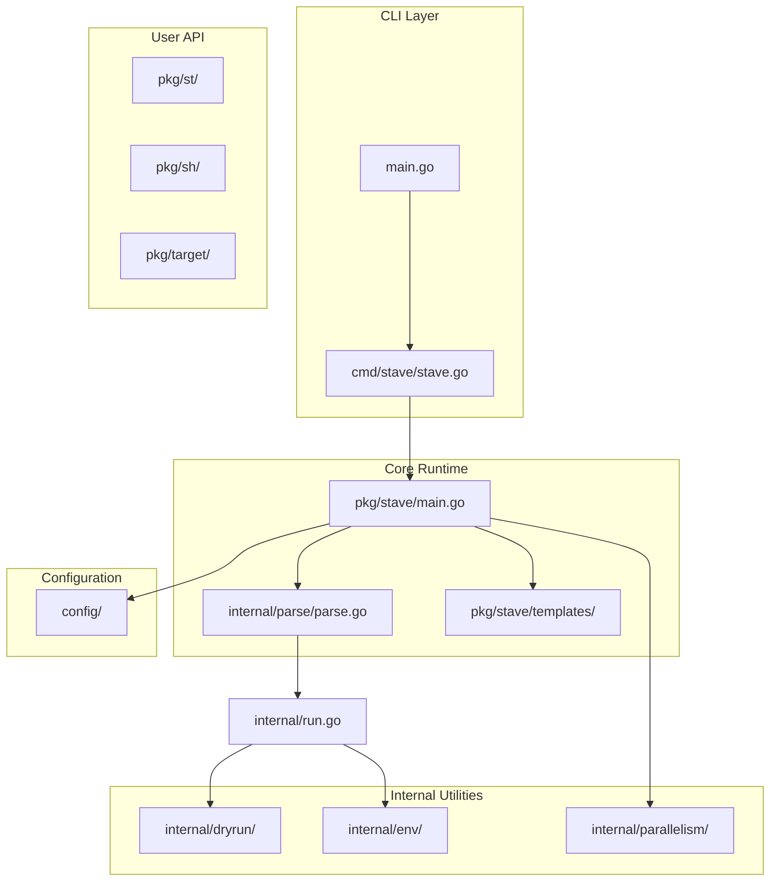

# RFC: Comprehensive Developer Documentation for Stave

**RFC ID:** rfc-20251204-docs-plan  
**Status:** Draft  
**Author:** Documentation Team  
**Created:** 2024-12-04  

## Summary

This RFC proposes a comprehensive documentation structure for Stave, covering both end-user documentation (how to use Stave) and contributor documentation (how to develop Stave itself).

## Motivation

Stave is a fork of Mage with additional features and improvements. To facilitate adoption and contributions, it requires clear, well-organized documentation that:

1. Helps new users get started quickly
2. Provides in-depth guides for advanced usage
3. Documents the API comprehensively
4. Enables contributors to understand the codebase and submit quality PRs

## Documentation Structure

```
docs/
├── index.md                     # Landing page / overview
├── getting-started/
│   ├── installation.md          # Installation methods
│   ├── quickstart.md            # First stavefile in 5 minutes
│   └── migration-from-mage.md   # Guide for Mage users
├── user-guide/
│   ├── stavefiles.md            # Writing stavefiles
│   ├── targets.md               # Defining targets
│   ├── dependencies.md          # st.Deps, SerialDeps, CtxDeps
│   ├── namespaces.md            # Organizing with st.Namespace
│   ├── arguments.md             # Target arguments (string, int, bool, duration)
│   ├── aliases.md               # Target aliases
│   ├── imports.md               # stave:import directive
│   ├── configuration.md         # Config files and environment variables
│   ├── shell-commands.md        # Using pkg/sh for command execution
│   ├── file-targets.md          # Using pkg/target for incremental builds
│   └── advanced/
│       ├── cross-compilation.md # --goos, --goarch, --compile
│       ├── dryrun-mode.md       # --dryrun functionality
│       ├── ci-integration.md    # Using Stave in CI/CD pipelines
│       └── debugging.md         # --debug, --verbose, troubleshooting
├── api-reference/
│   ├── cli.md                   # Command-line interface reference
│   ├── st/
│   │   ├── index.md             # pkg/st overview
│   │   ├── deps.md              # Deps, CtxDeps, SerialDeps, SerialCtxDeps
│   │   ├── fn.md                # F(), Fn interface
│   │   ├── errors.md            # Fatal, Fatalf, ExitStatus
│   │   ├── runtime.md           # Verbose, Debug, GoCmd, CacheDir, etc.
│   │   └── namespace.md         # Namespace type
│   ├── sh/
│   │   ├── index.md             # pkg/sh overview
│   │   ├── run.md               # Run, RunV, RunWith, RunWithV
│   │   ├── output.md            # Output, OutputWith
│   │   ├── exec.md              # Exec, CmdRan, ExitStatus
│   │   └── helpers.md           # Rm, Copy
│   └── target/
│       ├── index.md             # pkg/target overview
│       ├── path.md              # Path, PathNewer
│       ├── glob.md              # Glob, GlobNewer
│       └── dir.md               # Dir, DirNewer, OldestModTime, NewestModTime
├── contributing/
│   ├── index.md                 # Contributing overview
│   ├── development-setup.md     # Setting up the dev environment
│   ├── architecture.md          # Codebase architecture deep-dive
│   ├── code-style.md            # Go style guide, linting rules
│   ├── testing.md               # Running and writing tests
│   ├── pull-requests.md         # PR workflow and requirements
│   └── releasing.md             # Release process
└── changelog.md                 # Link to CHANGELOG.md
```

## Content Specifications

### 1. Getting Started

#### 1.1 Installation (`getting-started/installation.md`)

Content:
- Go install method (`go install github.com/yaklabco/stave@latest`)
- Building from source (`go run bootstrap.go`)
- Homebrew (if applicable)
- Verifying installation (`stave --version`)
- Shell completion setup

#### 1.2 Quickstart (`getting-started/quickstart.md`)

Content:
- Create first `stavefile.go` with build tag
- Define a simple target
- Run the target
- Add dependencies between targets
- Use `st.Deps()` for parallel execution

#### 1.3 Migration from Mage (`getting-started/migration-from-mage.md`)

Content:
- Renaming `magefile.go` to `stavefile.go`
- Changing build tag from `mage` to `stave`
- Updating imports from `github.com/magefile/mage` to `github.com/yaklabco/stave`
- Feature parity table
- New features in Stave

### 2. User Guide

#### 2.1 Stavefiles (`user-guide/stavefiles.md`)

Content:
- Build tag requirement (`//go:build stave`)
- Package declaration (must be `main`)
- File naming conventions
- Multiple stavefiles in a directory
- The `stavefiles/` directory convention
- Helper files without the build tag

#### 2.2 Targets (`user-guide/targets.md`)

Content:
- Function signature requirements
- Valid return types (`void`, `error`)
- Context parameter (`context.Context`)
- Case-insensitive matching
- Default target (`var Default = TargetName`)
- Target comments (synopsis extraction)
- `stave:help=` directive for custom help text

#### 2.3 Dependencies (`user-guide/dependencies.md`)

Content:
- `st.Deps()` - parallel execution
- `st.SerialDeps()` - sequential execution
- `st.CtxDeps()` - with context
- `st.SerialCtxDeps()` - serial with context
- Once semantics (each dep runs exactly once)
- Error propagation and exit codes
- Dependency trees

#### 2.4 Namespaces (`user-guide/namespaces.md`)

Content:
- Defining namespace types (`type Build st.Namespace`)
- Methods as namespaced targets
- Calling namespaced targets (`stave build:docker`)
- Namespaces in dependencies

#### 2.5 Arguments (`user-guide/arguments.md`)

Content:
- Supported types: `string`, `int`, `bool`, `float64`, `time.Duration`
- Positional arguments
- Using `st.F()` for deps with arguments
- Argument parsing and error handling

#### 2.6 Aliases (`user-guide/aliases.md`)

Content:
- Defining aliases (`var Aliases = map[string]interface{}{}`)
- Alias naming conventions
- Aliases for namespaced targets

#### 2.7 Imports (`user-guide/imports.md`)

Content:
- `// stave:import` directive syntax
- Importing with alias (`// stave:import alias`)
- Root imports vs aliased imports
- Avoiding target name conflicts

#### 2.8 Configuration (`user-guide/configuration.md`)

Content:
- Configuration file locations (XDG paths)
- `~/.config/stave/config.yaml` (user config)
- `./stave.yaml` (project config)
- Environment variables (`STAVEFILE_*`)
- Configuration precedence
- Available options:
  - `cache_dir`
  - `go_cmd`
  - `verbose`
  - `debug`
  - `hash_fast`
  - `ignore_default`
  - `enable_color`
  - `target_color`
- `stave config` subcommands

#### 2.9 Shell Commands (`user-guide/shell-commands.md`)

Content:
- `sh.Run()`, `sh.RunV()` - run commands
- `sh.Output()` - capture output
- `sh.Exec()` - full control
- `sh.RunWith()` - with environment
- `sh.RunCmd()`, `sh.OutCmd()` - command factories
- Environment variable expansion
- Error handling and exit codes
- Verbose mode behavior

#### 2.10 File Targets (`user-guide/file-targets.md`)

Content:
- Incremental builds concept
- `target.Path()` - check file modification times
- `target.Glob()` - with glob patterns
- `target.Dir()` - recursive directory checks
- `target.PathNewer()`, `target.GlobNewer()`, `target.DirNewer()`
- `target.OldestModTime()`, `target.NewestModTime()`

### 3. Advanced Topics

#### 3.1 Cross-Compilation (`user-guide/advanced/cross-compilation.md`)

Content:
- `--compile` flag for static binaries
- `--goos` and `--goarch` flags
- `--ldflags` for custom linker flags
- Use cases: distributing build tools

#### 3.2 Dry-Run Mode (`user-guide/advanced/dryrun-mode.md`)

Content:
- `--dryrun` flag behavior
- `STAVEFILE_DRYRUN` environment variable
- How `sh.Run*` functions behave in dry-run
- Custom dry-run handling with `dryrun.IsDryRun()`

#### 3.3 CI Integration (`user-guide/advanced/ci-integration.md`)

Content:
- GitHub Actions example
- GitLab CI example
- Caching compiled binaries
- Parallelism settings (`STAVE_NUM_PROCESSORS`)

#### 3.4 Debugging (`user-guide/advanced/debugging.md`)

Content:
- `--debug` flag
- `--verbose` flag
- `--keep` flag (keep generated mainfile)
- Reading generated code
- Common errors and solutions

### 4. API Reference

Detailed godoc-style documentation for each package and function.

### 5. Contributing Guide

#### 5.1 Development Setup (`contributing/development-setup.md`)

Content:
- Prerequisites (Go 1.21+, Node.js for husky)
- Cloning the repository
- Running `stave init` (or `go run bootstrap.go`)
- Installing dependencies (`brew bundle`, `npm ci`)
- IDE setup recommendations

#### 5.2 Architecture (`contributing/architecture.md`)

Content:



Detailed sections:
- Entry points and CLI flow
- Stavefile parsing (Go AST)
- Code generation (mainfile template)
- Compilation and caching
- Execution flow
- Package responsibilities

#### 5.3 Code Style (`contributing/code-style.md`)

Content:
- Go style conventions
- golangci-lint configuration
- Error handling patterns
- Logging with slog
- Test naming conventions
- Comment style (godoc)

#### 5.4 Testing (`contributing/testing.md`)

Content:
- Running tests (`stave test` or `go test ./...`)
- Test organization
- Table-driven tests
- Integration tests in `testdata/`
- Coverage requirements
- Testing dry-run functionality

#### 5.5 Pull Requests (`contributing/pull-requests.md`)

Content:
- Branch naming conventions
- Commit message format (conventional commits)
- PR template checklist
- Code review process
- CI requirements

#### 5.6 Releasing (`contributing/releasing.md`)

Content:
- Versioning (semver)
- Changelog maintenance
- `stave release` target
- goreleaser configuration
- Post-release checklist

## Implementation Plan

### Phase 1: Foundation (Week 1)

1. Create `docs/` directory structure
2. Set up documentation tooling (consider mdBook, Hugo, or Docusaurus)
3. Write `docs/index.md` landing page
4. Write `getting-started/` section

### Phase 2: User Guide (Week 2-3)

1. Write core user guide sections:
   - stavefiles.md
   - targets.md
   - dependencies.md
   - namespaces.md
2. Write remaining user guide sections:
   - arguments.md
   - aliases.md
   - imports.md
   - configuration.md
   - shell-commands.md
   - file-targets.md

### Phase 3: Advanced & API (Week 4)

1. Write advanced topics
2. Generate API reference from godoc
3. Cross-reference between sections

### Phase 4: Contributing Guide (Week 5)

1. Write development setup guide
2. Create architecture documentation with diagrams
3. Document code style and testing
4. Write PR and release guides

### Phase 5: Polish (Week 6)

1. Review all documentation for accuracy
2. Add examples and code samples
3. Create diagrams and illustrations
4. Set up search functionality
5. Deploy documentation site

## Documentation Tooling Options

| Tool | Pros | Cons |
|------|------|------|
| **mdBook** | Rust-based, simple, good for technical docs | Limited theming |
| **Hugo** | Fast, flexible, many themes | Steeper learning curve |
| **Docusaurus** | React-based, versioning built-in | Heavier, requires Node.js |
| **MkDocs** | Python-based, Material theme excellent | Requires Python |
| **GitHub Wiki** | Zero setup | Limited formatting, no versioning |
| **Plain Markdown** | Simplest, works with GitHub | No navigation, search |

**Recommendation:** Start with plain Markdown in `docs/` directory, renderable on GitHub. Consider mdBook or MkDocs Material for a dedicated docs site later.

## Success Criteria

1. New users can install and create their first stavefile in < 10 minutes
2. All public API functions are documented with examples
3. Contributors can set up development environment in < 15 minutes
4. Architecture is documented well enough that new contributors can navigate the codebase
5. Documentation is searchable and well-cross-referenced

## Open Questions

1. Should we host documentation on a separate site (e.g., stave.dev)?
2. Should API reference be auto-generated from godoc comments?
3. What level of Mage compatibility documentation is needed?
4. Should we include video tutorials?

## References

- [Mage Documentation](https://magefile.org/)
- [Go Documentation Best Practices](https://go.dev/doc/)
- [Diátaxis Documentation Framework](https://diataxis.fr/)

