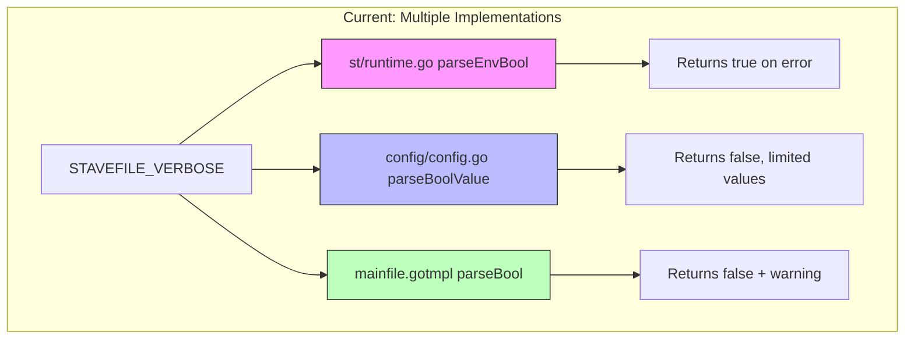
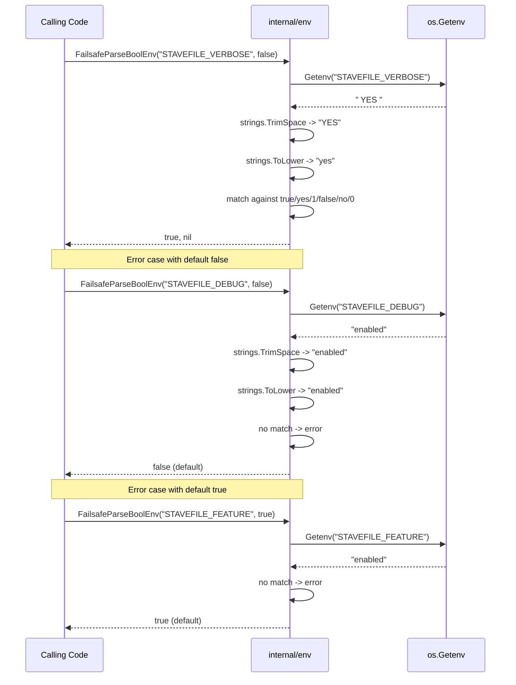

# RFC: Consolidate Boolean Environment Variable Parsing

**RFC ID:** rfc-20251206-001-env-bool-parsing  
**Status:** Draft  
**Author:** Core Team  
**Created:** 2025-12-06  
**Target Release:** TBD

## Summary

This RFC proposes consolidating five separate boolean environment variable parsing implementations into a single, canonical implementation in the `internal/env` package.

The current codebase contains multiple implementations with inconsistent behavior regarding:

- Whitespace handling
- Accepted string values
- Case sensitivity
- Error/fallback behavior

This consolidation will:

- Establish a single source of truth for boolean env parsing
- Accept user-friendly values: `"true"`, `"yes"`, `"1"` (and their uppercase variants) for true; `"false"`, `"no"`, `"0"` for false
- Provide case-insensitive matching via lowercasing
- Error on invalid values rather than silently defaulting
- Provide two wrapper functions for different default behaviors (false vs true)
- Improve testability and maintainability

---

## Motivation

During a code review, five distinct boolean parsing implementations were identified across the codebase, each with subtly different behavior:

| Location                    | Method              | Trims Whitespace | Error Behavior            |
| --------------------------- | ------------------- | ---------------- | ------------------------- |
| `pkg/st/runtime.go:137-149` | `strconv.ParseBool` | Yes              | Returns `true`            |
| `config/config.go:312-314`  | Exact string match  | No               | Returns `false`           |
| `mainfile.gotmpl:36-47`     | `strconv.ParseBool` | No               | Returns `false` + warning |
| `mainfile.gotmpl:221`       | `strconv.ParseBool` | No               | Returns `false` silently  |
| `mainfile.gotmpl:453`       | `strconv.ParseBool` | No               | Returns `false` silently  |

This inconsistency creates several problems:

- **User confusion**: Setting `STAVEFILE_VERBOSE=yes` does not work because `strconv.ParseBool` does not accept it, yet invalid values return `true` due to a bug in `pkg/st/runtime.go`.
- **Subtle bugs**: Whitespace in environment values (`" true "`) behaves differently depending on the code path.
- **Maintenance burden**: Five implementations means five places to update if behavior needs to change.
- **Testing gaps**: None of these implementations have dedicated unit tests.

We want:

- A **single, well-tested implementation** that all code paths use.
- **Predictable, documented behavior** that users can rely on.
- **User-friendly accepted values** (`"yes"`, `"no"`, `"true"`, `"false"`, `"1"`, `"0"`).
- **Case-insensitive matching** so `"TRUE"`, `"True"`, and `"true"` all work.
- **Fail-safe defaults** where invalid configuration does not accidentally enable features.

---

## Goals

- **Introduce canonical boolean parsing functions** in `internal/env/env.go`.
- **Migrate all existing call sites** to use the new implementation.
- **Establish consistent behavior**: trim whitespace, lowercase, accept explicit true/false/yes/no/1/0 values, error on invalid input.
- **Provide two wrapper functions**: one defaulting to `false` on error, one defaulting to `true` on error.
- **Add comprehensive unit tests** for the new implementation.
- **Maintain strict linting discipline** (`golangci-lint` remains unchanged).

## Non-Goals

- Changing the semantics of which environment variables control which features.
- Modifying CLI flag parsing (this RFC focuses solely on environment variable parsing).
- Adding new configuration options or environment variables.

---

## High-Level Architecture

### Current State



### Proposed State

```mermaid
graph TD
    subgraph "Proposed: Single Implementation"
        A[STAVEFILE_VERBOSE] --> B[internal/env.ParseBool]
        C[STAVEFILE_DEBUG] --> B
        D[STAVEFILE_HASHFAST] --> B
        E[Other STAVEFILE_* bools] --> B

        B --> F{Valid?}
        F -->|yes| G[Return parsed bool]
        F -->|no| H[Return error]

        I[FailsafeParseBoolEnv(_, false)] --> B
        J[FailsafeParseBoolEnv(_, true)] --> B
        I -->|error| K[Returns false]
        J -->|error| L[Returns true]
    end

    style B fill:#9f9,stroke:#333
```

### Data Flow



---

## Detailed Design

### New Functions in `internal/env/env.go`

Four new functions will be added to the existing `internal/env` package:

```go
// ErrInvalidBool is returned when a string cannot be parsed as a boolean.
var ErrInvalidBool = errors.New("invalid boolean value")

// ParseBool interprets a string value as a boolean.
// It trims leading and trailing whitespace, then lowercases the value
// before matching.
//
// Accepted values:
//   - "true", "yes", "1" return true
//   - "false", "no", "0" return false
//   - "" (empty) returns false with no error
//   - Any other value returns false with ErrInvalidBool
//
// This implementation follows GTS conventions for boolean parsing.
func ParseBool(value string) (bool, error) {
    value = strings.TrimSpace(value)
    if value == "" {
        return false, nil
    }

    switch strings.ToLower(value) {
    case "true", "yes", "1":
        return true, nil
    case "false", "no", "0":
        return false, nil
    default:
        return false, fmt.Errorf("%w: %q", ErrInvalidBool, value)
    }
}

// ParseBoolEnv reads an environment variable and parses it as a boolean
// using ParseBool. Unset variables are treated the same as empty strings.
func ParseBoolEnv(envVar string) (bool, error) {
    v := os.Getenv(envVar)
    return ParseBool(v)
}

// FailsafeParseBoolEnv reads an environment variable and parses it as a boolean.
// It returns defaultValue if the variable is unset, empty, or contains an invalid
// value. This provides a fail-safe default where invalid configuration does not
// accidentally enable or disable features, depending on the chosen default.
func FailsafeParseBoolEnv(envVar string, defaultValue bool) bool {
    v, ok := os.LookupEnv(envVar)
    if !ok || v == "" {
        return defaultValue
    }

    b, err := ParseBool(v)
    if err != nil {
        return defaultValue
    }

    return b
}
```

### Design Rationale

1. **Custom implementation over `strconv.ParseBool`**: While `strconv.ParseBool` is the Go standard library function, it accepts values like `"t"`, `"T"`, `"f"`, `"F"` which are not intuitive for configuration. Our implementation accepts the more user-friendly `"yes"` and `"no"` values that are common in configuration files and shell scripts.

2. **Case-insensitive matching**: By lowercasing the input before matching, we accept `"TRUE"`, `"True"`, `"true"`, `"YES"`, `"Yes"`, `"yes"` etc. without requiring explicit case handling. This is more forgiving for users.

3. **Trim whitespace**: Environment variables are often set via shell scripts, configuration management tools, or `.env` files where trailing whitespace can be accidentally introduced. Trimming provides robustness without changing semantic meaning.

4. **Error on invalid values**: Rather than silently returning a default, `ParseBool` returns an error for invalid values. This allows callers to handle configuration errors appropriately (log, fail fast, etc.).

5. **Single failsafe helper**: Different use cases require different default behaviors, but they are expressed via a single helper:

   - `FailsafeParseBoolEnv(envVar, false)`: Fail-safe for features that should be opt-in. Invalid config does not accidentally enable features.
   - `FailsafeParseBoolEnv(envVar, true)`: For features that should be enabled by default and only disabled by explicit configuration.

6. **Explicit accepted values**: Only `"true"`, `"yes"`, `"1"`, `"false"`, `"no"`, `"0"` are accepted. This is a strict, well-defined set that matches common conventions.

7. **Location in `internal/env`**: This package already exists and handles environment-related utilities. Adding boolean parsing here maintains cohesion.

### Accepted Values

The canonical implementation will accept the following values (case-insensitive after trimming and lowercasing):

| Value        | Result  | Error                   |
| ------------ | ------- | ----------------------- |
| `"true"`     | `true`  | no                      |
| `"TRUE"`     | `true`  | no                      |
| `"True"`     | `true`  | no                      |
| `"yes"`      | `true`  | no                      |
| `"YES"`      | `true`  | no                      |
| `"Yes"`      | `true`  | no                      |
| `"1"`        | `true`  | no                      |
| `"false"`    | `false` | no                      |
| `"FALSE"`    | `false` | no                      |
| `"False"`    | `false` | no                      |
| `"no"`       | `false` | no                      |
| `"NO"`       | `false` | no                      |
| `"No"`       | `false` | no                      |
| `"0"`        | `false` | no                      |
| `""` (empty) | `false` | no                      |
| `"  true  "` | `true`  | no (whitespace trimmed) |
| `"  YES  "`  | `true`  | no (whitespace trimmed) |
| `"t"`        | `false` | **yes** (invalid)       |
| `"f"`        | `false` | **yes** (invalid)       |
| `"on"`       | `false` | **yes** (invalid)       |
| `"off"`      | `false` | **yes** (invalid)       |
| `"enabled"`  | `false` | **yes** (invalid)       |

Note: Values like `"t"`, `"f"`, `"on"`, `"off"` which `strconv.ParseBool` accepts (or rejects inconsistently) are explicitly rejected. This is intentional to maintain a strict, predictable set of accepted values.

### Migration of Existing Code

#### 1. `pkg/st/runtime.go`

**Before:**

```go
func parseEnvBool(envVarName string) bool {
    strVal := strings.TrimSpace(os.Getenv(envVarName))
    if strVal == "" {
        return false
    }
    b, err := strconv.ParseBool(strVal)
    if err != nil {
        return true  // PROBLEM: returns true on error
    }
    return b
}
```

**After:**

```go
import "github.com/yaklabco/stave/internal/env"

// Remove parseEnvBool function entirely
// Update all call sites:

func Verbose() bool {
    return env.FailsafeParseBoolEnv(VerboseEnv, false)
}
```

This is a **behavioral change**: invalid values will now return `false` instead of `true`. This is considered a bug fix rather than a breaking change, as the previous behavior was almost certainly unintentional. Additionally, `STAVEFILE_VERBOSE=yes` will now work correctly (returning `true`).

#### 2. `config/config.go`

**Before:**

```go
func parseBoolValue(v string) bool {
    return v == "1" || v == "true" || v == "TRUE" || v == "True"
}
```

**After:**

```go
import "github.com/yaklabco/stave/internal/env"

func applyBoolEnv(envVar string, target *bool) {
    if v := os.Getenv(envVar); v != "" {
        b, _ := env.ParseBool(v)
        *target = b
    }
}
```

This **expands** accepted values to include `"yes"`, `"no"`, `"0"`, `"false"`, `"FALSE"`, and `"False"`. This is backward compatible as all previously accepted values remain accepted. Note that `"t"` and `"f"` are no longer accepted (they were never accepted by the old implementation anyway).

#### 3. `mainfile.gotmpl`

The template generates code that runs in the compiled stavefile binary. Since `internal/env` is an internal package, it cannot be imported by external code.

**Options:**

1. **Inline the canonical logic**: Update the template to generate code matching the canonical behavior.
2. **Move to `pkg/env`**: Make the package public so generated code can import it.

**Recommendation:** Option 1 (inline the canonical logic). The generated code is self-contained and should remain so. The template will be updated to generate:

```go
parseBool := func(envVar string) bool {
    val := strings.TrimSpace(os.Getenv(envVar))
    if val == "" {
        return false
    }
    switch strings.ToLower(val) {
    case "true", "yes", "1":
        return true
    case "false", "no", "0":
        return false
    default:
        return false  // Invalid value, fail-safe
    }
}
```

This matches the canonical behavior without requiring additional imports in the generated binary.

---

## Behavioral Changes Summary

| Context                           | Current Behavior          | New Behavior             | Impact               |
| --------------------------------- | ------------------------- | ------------------------ | -------------------- |
| `st.Verbose()` with `"yes"`       | Returns `true` (bug)      | Returns `true`           | Now correct          |
| `st.Verbose()` with `"invalid"`   | Returns `true` (bug)      | Returns `false`          | Bug fix              |
| `config.Load()` with `"yes"`      | Returns `false`           | Returns `true`           | Expanded acceptance  |
| `config.Load()` with `"no"`       | Returns `false`           | Returns `false`          | Expanded acceptance  |
| `config.Load()` with `"t"`        | Returns `false`           | Returns `false` + error  | Stricter validation  |
| `config.Load()` with `"  true  "` | Returns `false`           | Returns `true`           | Whitespace tolerance |
| Generated binary with `"yes"`     | Returns `false`           | Returns `true`           | Expanded acceptance  |
| Generated binary with `"invalid"` | Returns `false` + warning | Returns `false` (silent) | Cleaner output       |

---

## Backward Compatibility

### Breaking Change: `pkg/st/runtime.go`

The change to `parseEnvBool` is technically a breaking change: code that previously relied on invalid values (like `"enabled"`) evaluating to `true` will now see them evaluate to `false`.

**Mitigation:**

- The old behavior (returning `true` on error) was almost certainly a bug, not an intentional feature.
- No tests exercise this edge case.
- The new behavior is more intuitive and predictable.
- Users who were accidentally relying on this behavior can update their configuration to use a valid boolean value.

**Note:** `STAVEFILE_VERBOSE=yes` now correctly evaluates to `true`, which is an improvement over the old `strconv.ParseBool` behavior that would have returned an error (and thus `true` due to the bug).

### Non-Breaking: `config/config.go`

The expanded set of accepted values is strictly additive. All previously valid values (`"1"`, `"true"`, `"TRUE"`, `"True"`) remain valid with the same result. New values (`"yes"`, `"no"`, `"0"`, `"false"`, `"FALSE"`, `"False"`) are now also accepted.

Note: `"t"` and `"f"` are now explicitly rejected (they were never accepted by the old implementation anyway).

### Non-Breaking: Generated Code

The generated code in `mainfile.gotmpl` already returns `false` on error. The changes are:

- Adding whitespace trimming (additive, no semantic change for valid input).
- Adding case-insensitive matching (additive, `"TRUE"` now works anywhere).
- Adding `"yes"` and `"no"` acceptance (additive, common configuration values now work).
- Removing the warning log (cleaner output, no functional change).

---

## Alternatives Considered

### 1. Use `strconv.ParseBool` (Original RFC Proposal)

Use the Go standard library function for parsing boolean strings.

**Pros:**

- Go idiomatic.
- Well-documented, stable behavior.
- Widely understood by Go developers.

**Cons:**

- Does not accept `"yes"` and `"no"` which are common in configuration.
- Accepts `"t"`, `"T"`, `"f"`, `"F"` which are less intuitive.
- Case-sensitive matching for mixed case values.

**Decision:** Rejected in favor of a custom implementation that accepts a more user-friendly set of values.

### 2. Keep Separate Implementations with Aligned Behavior

Update each implementation independently to have consistent behavior.

**Pros:**

- No new shared code.
- Smaller diff.

**Cons:**

- Does not address the maintenance burden.
- Risk of drift over time.
- No single source of truth.

### 3. Return `true` on Error (Preserve `st/runtime.go` Behavior)

Standardize on the "any non-empty value means true" behavior.

**Pros:**

- Backward compatible with `st/runtime.go`.
- Permissive.

**Cons:**

- Violates principle of least surprise.
- Could mask configuration errors.
- Makes it impossible to distinguish between intentional `true` and misconfiguration.

### 4. Create a Public `pkg/env` Package

Make the environment utilities public so generated code can import them.

**Pros:**

- Single implementation everywhere, including generated code.

**Cons:**

- Adds a runtime dependency to compiled stavefiles.
- Increases binary size.
- Generated code should remain self-contained for portability.

### 5. Single Failsafe Helper (Final Decision)

Provide a single helper, `FailsafeParseBoolEnv(envVar, defaultValue bool)`, and express
opt-in vs opt-out behavior via the `defaultValue` parameter.

**Pros:**

- Simple API with a single entry point.
- Encourages explicit choice of default behavior at call sites.
- Avoids duplicating near-identical wrappers.

**Cons:**

- Callers must be explicit about the default value in each call.

**Decision:** Use `FailsafeParseBoolEnv` for all boolean environment defaults, passing
`false` for opt-in features and `true` for opt-out configuration.

### 6. Log a Warning on Invalid Values

When `ParseBoolEnv` encounters an invalid value, log a warning.

**Pros:**

- Helps users identify configuration mistakes.

**Cons:**

- Adds complexity.
- Warning destination unclear in library context.
- The current `mainfile.gotmpl` implementation does this, and removing it is considered an improvement (cleaner output).

**Decision:** Warnings are out of scope for this RFC but could be reconsidered in the future via a separate logging/diagnostic system.

---

## Testing Strategy

### Unit Tests for `internal/env`

New test file `internal/env/env_test.go`:

```go
func TestParseBool(t *testing.T) {
    tests := []struct {
        input   string
        want    bool
        wantErr bool
    }{
        // True values (case-insensitive)
        {"1", true, false},
        {"true", true, false},
        {"TRUE", true, false},
        {"True", true, false},
        {"tRuE", true, false},
        {"yes", true, false},
        {"YES", true, false},
        {"Yes", true, false},
        {"yEs", true, false},

        // False values (case-insensitive)
        {"0", false, false},
        {"false", false, false},
        {"FALSE", false, false},
        {"False", false, false},
        {"fAlSe", false, false},
        {"no", false, false},
        {"NO", false, false},
        {"No", false, false},
        {"nO", false, false},

        // Empty
        {"", false, false},

        // Whitespace handling
        {"  true  ", true, false},
        {"  false  ", false, false},
        {"  yes  ", true, false},
        {"  no  ", false, false},
        {"  1  ", true, false},
        {"  0  ", false, false},
        {"\ttrue\n", true, false},
        {"\tYES\n", true, false},

        // Invalid values (return error)
        {"t", false, true},
        {"f", false, true},
        {"T", false, true},
        {"F", false, true},
        {"on", false, true},
        {"off", false, true},
        {"enabled", false, true},
        {"disabled", false, true},
        {"invalid", false, true},
        {"2", false, true},
        {"-1", false, true},
        {"y", false, true},
        {"n", false, true},
    }

    for _, tt := range tests {
        t.Run(tt.input, func(t *testing.T) {
            got, err := ParseBool(tt.input)
            if (err != nil) != tt.wantErr {
                t.Errorf("ParseBool(%q) error = %v, wantErr %v", tt.input, err, tt.wantErr)
            }
            if got != tt.want {
                t.Errorf("ParseBool(%q) = %v, want %v", tt.input, got, tt.want)
            }
        })
    }
}

func TestFailsafeParseBoolEnvDefaultFalse(t *testing.T) {
    tests := []struct {
        name   string
        envVal string
        setEnv bool
        want   bool
    }{
        {"unset", "", false, false},
        {"empty", "", true, false},
        {"true", "true", true, true},
        {"TRUE", "TRUE", true, true},
        {"yes", "yes", true, true},
        {"YES", "YES", true, true},
        {"1", "1", true, true},
        {"false", "false", true, false},
        {"no", "no", true, false},
        {"0", "0", true, false},
        {"invalid", "enabled", true, false},
        {"whitespace", "  true  ", true, true},
    }

    for _, tt := range tests {
        t.Run(tt.name, func(t *testing.T) {
            const envVar = "TEST_FAILSAFE_PARSE_BOOL_ENV_DEFAULT_FALSE"
            if tt.setEnv {
                t.Setenv(envVar, tt.envVal)
            }
            if got := FailsafeParseBoolEnv(envVar, false); got != tt.want {
                t.Errorf("FailsafeParseBoolEnv(%q, false) = %v, want %v", envVar, got, tt.want)
            }
        })
    }
}

func TestFailsafeParseBoolEnvDefaultTrue(t *testing.T) {
    tests := []struct {
        name   string
        envVal string
        setEnv bool
        want   bool
    }{
        {"unset", "", false, true},        // Default true when unset
        {"empty", "", true, true},         // Default true when empty
        {"true", "true", true, true},
        {"yes", "yes", true, true},
        {"1", "1", true, true},
        {"false", "false", true, false},
        {"no", "no", true, false},
        {"0", "0", true, false},
        {"invalid", "enabled", true, true}, // Default true on error
        {"whitespace", "  false  ", true, false},
    }

    for _, tt := range tests {
        t.Run(tt.name, func(t *testing.T) {
            const envVar = "TEST_FAILSAFE_PARSE_BOOL_ENV_DEFAULT_TRUE"
            if tt.setEnv {
                t.Setenv(envVar, tt.envVal)
            }
            if got := FailsafeParseBoolEnv(envVar, true); got != tt.want {
                t.Errorf("FailsafeParseBoolEnv(%q, true) = %v, want %v", envVar, got, tt.want)
            }
        })
    }
}
```

### Integration Tests

Existing tests in `config/config_test.go` and `pkg/st/` will be updated to use valid boolean values, ensuring the migration does not break existing functionality.

---

## Migration Plan

### Phase 1: Add Canonical Implementation

1. Add `ParseBool`, `ParseBoolEnv`, and `FailsafeParseBoolEnv` to `internal/env/env.go`.
2. Add `ErrInvalidBool` error type.
3. Add comprehensive unit tests for all functions.
4. Ensure all tests pass and linting is clean.

### Phase 2: Migrate `config/config.go`

1. Replace `parseBoolValue` with calls to `env.ParseBool`.
2. Update any related tests.
3. This is backward compatible (expanded value acceptance).

### Phase 3: Migrate `pkg/st/runtime.go`

1. Replace `parseEnvBool` with `env.FailsafeParseBoolEnv(envVar, false)`.
2. This is a behavioral change (invalid values now return `false` instead of `true`).
3. This is also a feature improvement (`STAVEFILE_VERBOSE=yes` now works correctly).
4. Add release note documenting the fix.

### Phase 4: Update `mainfile.gotmpl`

1. Update the inline `parseBool` function to match canonical behavior (lowercase, match against true/yes/1/false/no/0).
2. Remove the warning log on invalid values.
3. Update any generated-code tests.

### Phase 5: Documentation

1. Update configuration documentation to list accepted boolean values.
2. Document the two wrapper functions and when to use each.
3. Add note about whitespace tolerance and case-insensitivity.

---

## Open Questions

1. **Should we log warnings for invalid boolean values?**

   Currently proposed: No. Invalid values return an error which wrapper functions can handle. The wrappers silently return their default value.

   Alternative: Log a warning to help users identify configuration mistakes. This would require determining where to log (stderr? structured logging?) and could add noise.

2. **Should `ParseBool` be public (`pkg/env`)?**

   Currently proposed: No. Keep it internal; generated code inlines the logic.

   Alternative: Make it public for consistency. Downstream users could benefit from a well-tested boolean parser.

3. **Should empty string return an error or be treated as valid?**

   Currently proposed: Empty string returns `false` with no error. This allows unset environment variables to work naturally without requiring explicit handling.

   Alternative: Treat empty string as invalid and return an error. The wrappers would then apply the default. This would make the behavior more explicit but could cause unexpected errors for users who expect unset variables to behave like `false`.

---

## Conclusion

This RFC proposes consolidating five boolean environment parsing implementations into a single canonical implementation in `internal/env`. The new implementation:

- Trims whitespace and lowercases input for case-insensitive matching
- Accepts `"true"`, `"yes"`, `"1"` as true values
- Accepts `"false"`, `"no"`, `"0"` as false values
- Returns an error for any other non-empty value
- Provides a single helper: `FailsafeParseBoolEnv` (with `defaultValue` controlling opt-in vs opt-out behavior)

This approach follows GTS conventions and provides a user-friendly, predictable API.

The migration is largely backward compatible, with one intentional behavioral change in `pkg/st/runtime.go` where invalid values will now return `false` instead of `true`. This is considered a bug fix. Additionally, `STAVEFILE_VERBOSE=yes` and similar common configurations will now work correctly.

The result is a simpler, more maintainable codebase with consistent, predictable behavior for boolean environment variables.
